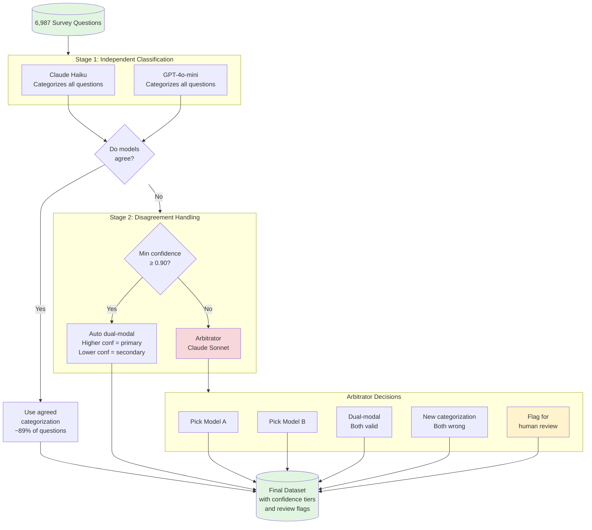
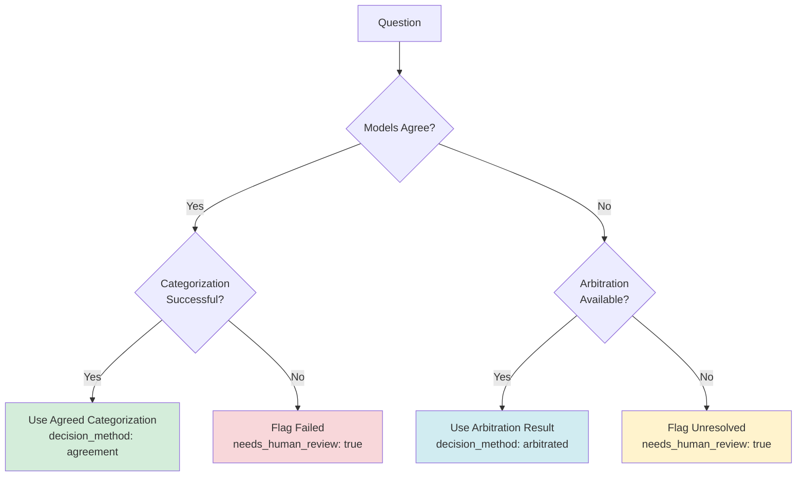

# Case Study: Federal Survey Concept Mapper

This chapter walks through a real federal workflow that demonstrates bounded agency in practice. Same concepts as the recipe example, but with higher stakes, tighter constraints, and more sophisticated uncertainty handling.

The code is open source: [github.com/brockwebb/federal-survey-concept-mapper](https://github.com/brockwebb/federal-survey-concept-mapper)

## The Problem

The Census Bureau operates dozens of surveys. Each asks questions that overlap, duplicate, or relate to questions in other surveys. Nobody had a comprehensive map of how 6,987 questions across 46 surveys relate to the Bureau's official taxonomy of concepts.

Doing this manually would take hundreds of hours. And humans would disagree with each other constantly about edge cases.

This is a classification problem at scale, with inherent ambiguity.

## The Design Choice

We could have built an "autonomous agent" that categorizes everything and presents final answers. That would be fast and impressive-looking.

It would also be wrong a lot, in ways we couldn't predict or catch.

Instead, we built a **workflow with selective agency**. The system does the heavy lifting, but agency is granted only where it's appropriate, and bounded by explicit constraints.

## The Architecture

Two cheaper models classify independently. When they agree (89% of the time), we use that answer. When they disagree, a more capable model arbitrates.

But the arbitrator isn't autonomous. It has explicit constraints and limited options.

## The Arbitrator: Bounded Agency in Practice

The arbitrator is the only "agentic" component in the pipeline. Here's how its agency is bounded:

**Limited decision space.** The arbitrator can only choose from:
- Pick Model A's answer
- Pick Model B's answer  
- Declare dual-modal (question spans two concepts)
- Propose a new categorization
- Flag for human review

It cannot invent new taxonomy categories. It cannot skip questions. It cannot change the rules.

**Confidence thresholds.** If both models disagree but both have confidence ≥ 0.90, we don't even call the arbitrator. We auto-assign as dual-modal (the question genuinely spans concepts). The arbitrator only sees cases with real uncertainty.

**Mandatory reasoning.** Every decision requires explicit justification. We can audit why any categorization was made.

**Human review flags.** When confidence is too low or the situation is too ambiguous, the system doesn't guess. It flags for human review.

## The Reconciliation Decision Tree

This diagram shows exactly how every question gets resolved:

Notice: **every path has a defined outcome**. There's no ambiguity about what happens. The system either resolves the question or explicitly flags it for human attention.

## Why Two Models?

Using two independent classifiers isn't about "more is better." It serves specific purposes:

**Cross-validation.** When both models agree, confidence is high. When they disagree, we've identified genuine ambiguity.

**Bias reduction.** Each model has blind spots. Two models catch different edge cases.

**Calibration.** Agreement rate tells us how hard the problem is. If models disagree constantly, maybe the taxonomy is flawed.

## Why 0.90 Confidence Threshold?

The threshold isn't arbitrary. It emerged from analysis:

- Below 0.90: genuine uncertainty exists, arbitration adds value
- At or above 0.90: both models are confident in different answers, suggesting the question legitimately spans multiple concepts

The threshold captures ~76% of disagreements for arbitration while auto-resolving the clearest dual-modal cases.

## Results

| Metric | Value |
|--------|-------|
| Questions processed | 6,987 |
| Categorization success rate | 99.5% |
| Model agreement (topic level) | 89% |
| Cohen's Kappa | 0.842 ("almost perfect") |
| Dual-modal questions | ~2.5% |
| Flagged for human review | <1% |
| Total cost | ~$15 |
| Total runtime | ~2 hours |

The system handled 6,987 questions for $15 in two hours. A human team would take weeks and cost thousands.

More importantly: the audit trail is complete. Every decision is traceable. Every edge case is documented.

## What Makes This Different

Compare this to the "autonomous agent" fantasy:

| Autonomous Agent Approach | This Workflow |
|--------------------------|---------------|
| One model decides everything | Cross-validation catches errors |
| Confidence is implicit | Confidence tiers are explicit |
| Edge cases get guessed | Edge cases get flagged |
| Audit trail is murky | Every decision documented |
| Failures are silent | Failures are surfaced |

The workflow is slower to design. It requires thinking through failure modes upfront. But the output is defensible in ways that matter for federal work.

## The Teaching Point

This case study demonstrates:

- **Workflow-first design.** The structure came before the agent. Agency was added only where needed.
- **Bounded agency.** The arbitrator has decision-making power, but within explicit constraints.
- **Confidence thresholds.** Uncertainty is quantified and handled, not hidden.
- **Human review fail-safes.** The system knows when to stop and ask.
- **Auditability.** Every decision can be traced and justified.

The recipe example showed the pattern. This shows the pattern at scale, with the kind of constraints that federal work demands.

You don't need this level of complexity for most problems. But when you do, this is how you build it.
