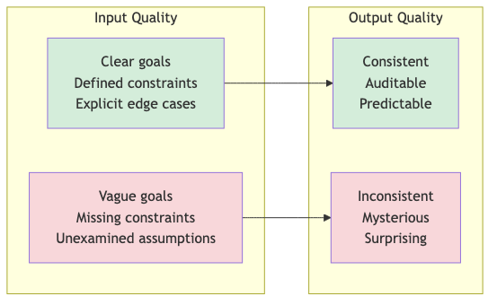
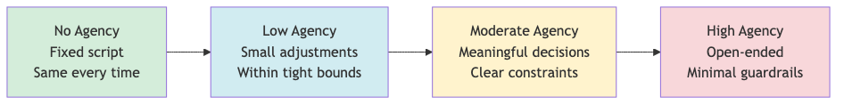
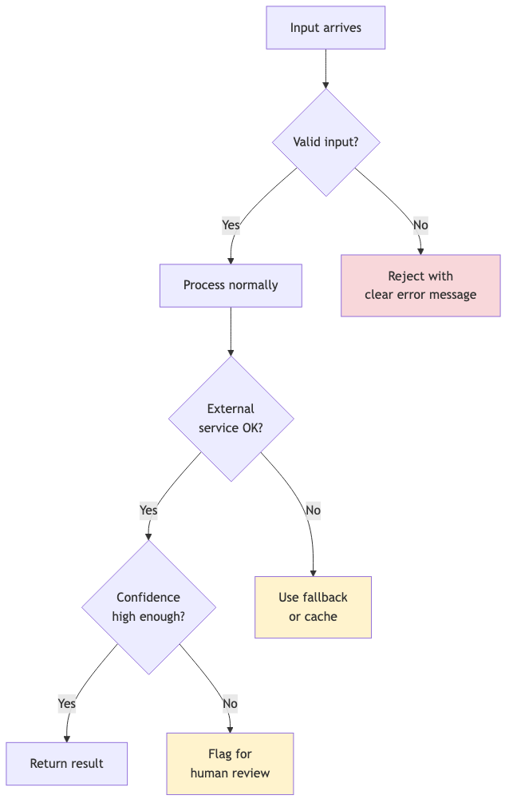
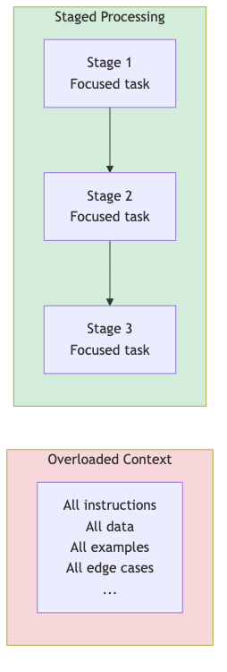

# Design Principles

These are the ideas that should stay with you after the vocabulary fades and the examples blur. If you remember nothing else, remember these.

## 1. Without Good Judgment in Upfront Design, Junk Probability Skyrockets

AI doesn't fix bad process. It accelerates it.

If your workflow is poorly defined, an agent will produce poorly defined outputs faster. If your criteria are vague, the agent will make vague decisions at scale. If you haven't thought through edge cases, the agent will hit those edge cases and do something you didn't anticipate.

The quality of agent output is bounded by the quality of agent design. No amount of model capability compensates for unclear instructions, missing constraints, or unexamined assumptions.

**Practical implication:** Spend more time on design than you think you need. The time you "save" by rushing into implementation, you'll spend debugging unexpected behavior.

> **What ignoring this causes:** Misinterpretation of instructions, agent misalignment, hallucinations, and incorrect decision-making. Microsoft's AI Red Team documents these as the most common failure modes in deployed agents—nearly all trace back to insufficient upfront design.

## 2. Agency Requires Governance

Giving an agent more agency is not an improvement. It's a tradeoff.

More agency means more flexibility. It also means less predictability. The question isn't "how much can we let it do?" but "how much agency does this task actually require?"

Most tasks don't require much. A well-structured workflow with minimal agency often outperforms a loosely-defined agent with maximum flexibility.

**The dial, not the switch:**

Move right only when you have to. Stay left when you can.

**Practical implication:** Start with the least agency that accomplishes the goal. Add more only when you've identified specific decisions that require it.

> **What ignoring this causes:** Excessive agency, impact outside intended environment, and prioritization failures that harm users. Autonomous agents given latitude without governance make decisions their designers never anticipated—sometimes catastrophically.

## 3. Most Problems Don't Need Agents (And That's Fine)

The hype cycle wants you to believe everything should be agentic. That's marketing, not engineering.

Many problems are better solved with:
- A simple prompt and a copy-paste workflow
- A traditional script with no AI at all
- A human making the decision directly

Agents add value when:
- The task has genuine variability that can't be pre-scripted
- Decisions need to be made at scale
- The cost of human attention exceeds the cost of imperfect automation

If those conditions aren't met, you don't need an agent. You need a simpler solution.

**Practical implication:** Before building an agent, ask: "What's the simplest thing that could work?" Often, that's the right answer.

> **What ignoring this causes:** Organizational knowledge loss and unnecessary attack surface. Every capability you add is a capability that can fail or be exploited. Simpler systems have fewer failure modes.

## 4. The Skill Is Describing What You Want and Spotting Bad Design

You don't need to code to work with agents. But you do need to think clearly.

The core skill is **specification**: being precise about what you want, what constraints apply, what success looks like, and what should happen when things go wrong.

The second skill is **recognition**: looking at an agent workflow and spotting where it's going to fail. Where are the vague instructions? Where are the missing guardrails? Where will edge cases cause problems?

Both skills improve with practice. Neither requires a computer science degree.

**The specification checklist:**

| Question | Why It Matters |
|----------|----------------|
| What's the goal? | Agents need a target |
| What are the constraints? | Bounds prevent chaos |
| What does success look like? | You need to know when you're done |
| What should happen when it's uncertain? | Silence is not a strategy |
| How will you know if it's wrong? | You need feedback loops |

**Practical implication:** Practice writing prompts that are unambiguous. Show them to someone else. If they interpret them differently than you intended, the agent will too.

> **What ignoring this causes:** Incorrect permissions, insufficient transparency, and accountability gaps. When specifications are vague, agents interpret them—and their interpretations may grant themselves capabilities you never intended.

### Quick Reference: Describing an Agent

When you need to specify what an agent should do, fill in these blanks:

> As a **[role]**, I want the agent to **[narrow outcome]** so that **[business value]**.
>
> The agent is allowed to see: **[systems/data types]**
>
> The agent is allowed to do: **[actions, e.g., propose flags, draft responses]**
>
> The agent must never: **[forbidden actions]**
>
> If the agent is unsure or the decision is high stakes, it must: **[who to ask / how to escalate]**

If you can't fill in every blank, you don't have a clear enough design yet.

### Quick Reference: Reviewing Agent Behavior

When evaluating whether an agent is working correctly, ask these four questions:

1. Did it stay within its job description and data boundaries?
2. Is the action correct in context?
3. Is the rationale understandable?
4. Would I sign my name under this action?

If the answer to any question is "no," mark it as a bad example. Collect these examples. They become your test cases for improving the agent.

## 5. Design for Uncertainty

Things will go wrong. The question is whether you've designed for that possibility.

**Build in checkpoints.** Don't let agents run indefinitely without human visibility. The recipe workflow pauses at the allergen check. The FSCM pipeline flags low-confidence cases. These aren't bugs; they're features.

**Know when it should stop and ask.** An agent that guesses when it's uncertain is worse than useless. Define the conditions under which the agent should halt and request human input.

**Design for what goes wrong, not just what goes right.** Happy path design is easy. Robust design considers: What if the input is malformed? What if the external service is down? What if the model returns garbage? Each failure mode needs a response.

**Practical implication:** For every step in your workflow, ask: "What happens if this fails?" If you don't have an answer, you have a gap.

> **What ignoring this causes:** Human-in-the-loop bypass, insufficient isolation, and agent denial of service. Systems without fail-safes run until they hit something hard—often taking other systems down with them.

## 6. Break Tasks Into Digestible Chunks

Context windows have hard limits. More importantly, model performance degrades before you hit those limits.

Stuffing everything into one massive prompt doesn't work. The model loses track, misses instructions, hallucinates connections. Quality suffers even when the task technically "fits."

**The 67-80% rule:** Aim to use 67-80% of available context at most. Leave room for the model to reason. Leave room for your output. Leave room for error.

**Specificity is kindness:** A focused prompt with clear scope outperforms a sprawling prompt that tries to cover everything. If your task is complex, break it into stages. Let each stage do one thing well.

**Practical implication:** If your prompt is getting long and complex, that's a signal to decompose the task, not a challenge to fit more in.

> **What ignoring this causes:** Resource exhaustion, loss of data provenance, and increased hallucination rates. Overloaded contexts don't fail gracefully—they fail subtly, producing confident-sounding garbage.

## The Meta-Principle: AI Amplifies Your Process

Good process + AI = faster good outcomes.

Bad process + AI = faster bad outcomes.

AI doesn't relieve you of the need for clear thinking, good documentation, or sound project management. It amplifies whatever you bring to it.

If you're organized, AI helps you move faster. If you're chaotic, AI helps you create chaos at scale.

The fundamentals still matter: know what you're trying to accomplish, break it into manageable pieces, define success criteria, build in feedback loops, document your decisions.

AI is a multiplier. What it multiplies is up to you.

## Summary

| Principle | One-Line Version |
|-----------|------------------|
| 1. Good judgment upfront | Design quality bounds output quality |
| 2. Agency requires governance | Less agency is often better |
| 3. Most problems don't need agents | Simple solutions beat complex ones |
| 4. Specification is the skill | Clarity beats capability |
| 5. Design for uncertainty | Plan for failure, not just success |
| 6. Digestible chunks | Focused beats sprawling |

### The Stakes: What These Principles Prevent

These aren't abstract best practices. Microsoft's AI Red Team has documented a taxonomy of failure modes in agentic AI systems—security breaches, safety failures, cascading errors, unintended actions. Nearly every failure mode they identify traces back to violating one of these principles:

- **Insufficient upfront design** → misinterpretation, misalignment, hallucinations
- **Excessive agency** → actions outside intended scope, user harm
- **Unnecessary complexity** → attack surface, organizational knowledge loss
- **Vague specifications** → incorrect permissions, accountability gaps
- **No failure planning** → cascading failures, denial of service
- **Overloaded contexts** → subtle degradation, lost provenance

The principles aren't about being cautious. They're about building systems that work.

These principles won't make you an AI expert. They'll help you avoid the mistakes that trip up people who think tools alone are the answer.
