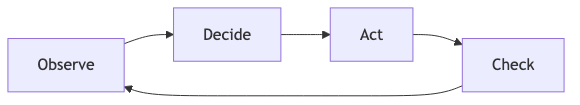

# Vocabulary

Before diving into examples, we need shared definitions. These terms get thrown around loosely, which creates confusion. Here they are in their "pure" form.

Real-world usage is messier. Everything exists on a spectrum. But you need the baseline definitions before you can navigate the nuance.

## The Core Terms

### Workflow

A workflow is a structure. A container. A defined sequence of steps.

Traditional workflows are static: Step A, then Step B, then Step C. Inputs and outputs are expected and well-defined. If something unexpected happens, the workflow breaks or stops.

Workflows can incorporate agents. When they do, the workflow provides the structure while agents handle the parts that require flexibility or judgment.

**Key point:** A workflow is not an agent. It is the scaffolding that agents can operate within.

### Agent

An agent is an entity that does work.

That's it. The term itself is simple. What varies is how much decision-making authority the agent has.

When you talk to a customer service representative, they're an agent. Some can solve your problem on the spot. Others need to check with their manager for every decision. Both are agents. They differ in how much authority they've been granted.

In AI, an agent is software that can take actions toward a goal. It might be tightly controlled (following explicit rules) or loosely controlled (figuring out its own approach). The degree of control is a design choice.

### Agency

Agency is the grant of decision-making authority.

When you tell a system "when you see X, do Y based on your judgment," you are granting agency. You are delegating a decision.

Agency is not binary. You can grant a little or a lot. You can grant it for specific situations or broadly. The question is always: what decisions are you comfortable delegating, and under what constraints?

### Agentic

Agentic describes behavior where agency is being exercised.

If a system follows the same steps every time regardless of context, it is not acting agentically. If it adjusts its approach based on what it encounters, it is.

**The practical test:** Does the system have flexibility to adapt, or does it execute a fixed recipe?

Agentic is a dial, not a switch. A system can be slightly agentic (making small adjustments within tight bounds) or highly agentic (choosing its own path with minimal constraints). More agentic means more flexibility. It also means less predictability.

### Tool (or Function)

A tool is a single, discrete operation. Query a database. Send an email. Classify a document. Validate a file.

Tools do not set goals. They do not decide what to do next. They execute one specific action when called.

Agents use tools. The agent decides which tool to use and when. The tool just does its job.

## Memory and Context

### Context Window

The context window is the agent's working memory. It is everything the model can "see" at once: the conversation so far, any documents you've provided, system instructions, and the current prompt.

Context windows have hard limits. When you exceed them, content gets truncated or dropped. The model has no awareness of what was cut. It only knows what's currently in the window.

This is why long conversations can feel like the agent "forgot" earlier details. It didn't forget in a human sense. That content simply fell outside the window.

### Context Management

Context management is the practice of working within context window limits. What goes in? What stays out? What gets summarized? What gets stored elsewhere and retrieved when needed?

Good context management is invisible when done well. Bad context management shows up as agents that lose track of instructions, repeat themselves, or miss important details you already provided.

For complex workflows, context management becomes an architectural concern, not an afterthought.

### Memory

Memory in AI systems comes in two forms:

**Short-term memory:** What's currently in the context window. Immediate, accessible, but temporary.

**Long-term memory:** Information persisted outside the context window. Databases, files, vector stores. This information must be explicitly retrieved and loaded into context when needed.

An agent with only short-term memory forgets everything between sessions. An agent with long-term memory can recall past interactions, reference stored knowledge, and maintain continuity over time.

The tradeoff: long-term memory adds complexity. You need systems to store, index, retrieve, and decide what's relevant. More capability, more engineering.

### AGENTS.md (or project instruction files)

AGENTS.md, claude.md, and similar files are a convention for passing persistent instructions to an agent at the project level.

Instead of repeating instructions every conversation, you write them once in a file. The agent reads this file as part of its context, shaping its behavior consistently across sessions.

This is an architectural pattern for managing context and maintaining shared understanding. The file becomes part of the agent's "memory" of how it should behave within a specific project or domain.

Different tools use different filenames (AGENTS.md, claude.md, .cursorrules, etc.), but the concept is the same: instructions that persist across interactions without manual repetition.

## The Loop

At the center of agent behavior is a simple pattern:

**Observe:** Take in information about the current state.

**Decide:** Determine what to do next based on the goal and current state.

**Act:** Execute the chosen action, often by using a tool.

**Check:** Evaluate the result. Is the goal met? Should we continue?

This loop repeats until the goal is achieved, an exit condition is met, or the system gets stuck.

The loop is the heartbeat of agent behavior. Frameworks and tools vary, but this pattern remains constant. If you understand the loop, you understand agents.

## A Note on "Assistants"

You may hear people distinguish between "assistants" and "agents." The typical framing: an assistant waits for your input after every response, while an agent runs autonomously.

This distinction is becoming less useful. Modern reasoning models already deliberate internally, considering approaches and revising their thinking within a single response. The line between "waiting for you" and "acting autonomously" is blurrier than it used to be.

A more useful framing: "assistant" describes an interaction pattern (back-and-forth, human-driven) rather than a fundamentally different kind of system. The same underlying model can behave as an assistant or an agent depending on how you set it up.

For this document, we focus on **workflow**, **agent**, **agency**, and **agentic**. These terms do the most work in clarifying what people actually mean.

## Summary Table

| Term | What It Is | Key Question |
|------|-----------|--------------|
| Workflow | Structure, container, sequence of steps | What's the process? |
| Agent | Entity that does work | What's doing the work? |
| Agency | Granted decision-making authority | What decisions can it make? |
| Agentic | Behavior where agency is exercised | How much can it adapt? |
| Tool | Single discrete operation | What can it do? |
| Context Window | Working memory, finite capacity | What can it see right now? |
| Memory | Short-term (in context) and long-term (persisted) | What can it remember? |
| AGENTS.md | Project-level instruction file | How should it behave here? |

