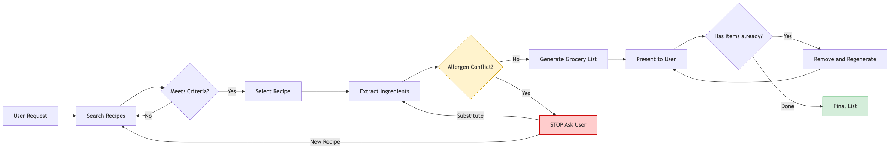

# Basic Pipeline Example

This chapter introduces a simple workflow that demonstrates the core concepts in action. The example is intentionally approachable: no domain expertise required, no jargon, something everyone can relate to.

More importantly, the prompt that runs this workflow IS the teaching artifact. When I demo this live, I load this exact text. No magic behind the curtain.

## The Scenario

You want to make dinner. You have a dish in mind but no recipe memorized. You need:

1. A good recipe (not just any recipe, a well-reviewed one)
2. The ingredients extracted as a list
3. A check against any dietary restrictions
4. A shopping list you can actually use

That's a workflow with multiple steps, decisions, and potential stopping points.

## The Workflow



Here's what we're asking the system to do:

**Step 1 - Observe:** User says "I want to make chicken cacciatore."

**Step 2 - Decide:** Find a highly-rated recipe. This is a judgment call. What counts as "highly-rated"? We'll define criteria.

**Step 3 - Act:** Search for recipes, select one that meets criteria, extract ingredients.

**Step 4 - Check:** Does the user have dietary restrictions? Allergies? If the recipe conflicts, stop and ask before proceeding.

**Step 5 - Act:** Generate the grocery list.

**Step 6 - Check:** Present the list. Done.

Notice the pattern? Observe → Decide → Act → Check. That's The Loop from the vocabulary chapter, showing up in practice.

The diagram above shows the full flow, including the decision points (diamonds) where the system exercises judgment and the human checkpoints where it pauses for input. Notice:

- The allergen check is a hard gate. The system cannot proceed without user input.
- The "anything you already have?" step creates a refinement loop.
- Multiple paths exist depending on what happens at each decision point.

This is what distinguishes a workflow with agency from a simple script.

## The Prompt

Here's the actual prompt. This is not pseudocode. This is what you would paste into Claude or another capable model to run this workflow.

```
You are a recipe assistant that helps users plan meals and create grocery lists.

When the user requests a dish:

1. SEARCH for highly-rated recipes (4+ stars, reputable sources like Serious Eats, NYT Cooking, Bon Appétit, or well-reviewed AllRecipes submissions). Prefer recipes with clear ingredient lists and reasonable prep times.

2. SELECT one recipe. Briefly explain why you chose it (rating, source credibility, matches the dish requested).

3. EXTRACT the full ingredient list. Standardize quantities where reasonable (e.g., "1 28-oz can crushed tomatoes" not "one large can tomatoes").

4. CHECK against user's stated dietary restrictions or allergies. If there's a conflict:
   - STOP
   - Explain the conflict clearly
   - Ask if they want a substitution or a different recipe
   - Do not proceed until they respond

5. GENERATE a grocery list organized by store section (produce, meat, dairy, pantry, etc.). Include quantities.

6. ASK: "Anything on this list you already have? Give me the numbers and I'll remove them."

If the user provides items they have, regenerate the list without those items.

---

User dietary restrictions: [none stated yet - ask if unclear]

User request: I want to make chicken cacciatore
```

That's it. That's the whole implementation.

## What Makes This "Agentic"

Look at what this prompt enables:

**Decision points with criteria:** The system decides which recipe to select, but within bounds we defined (4+ stars, reputable sources). It has agency, but constrained agency.

**Conditional branching:** The allergy check creates a hard stop. The system can't just plow through. If there's a conflict, it must pause and ask. That's a governance choice embedded in the workflow.

**Iteration:** The "anything you already have?" step creates a refinement loop. The system doesn't just produce output and walk away. It invites correction.

**Transparency:** "Briefly explain why you chose it" forces the system to show its reasoning. You can evaluate whether the decision was sound.

## What This Is NOT

This is not a fully autonomous agent. It doesn't:

- Run unsupervised for hours
- Make purchases on your behalf
- Manage multi-session state
- Learn from past interactions

It's a single-session workflow with human checkpoints. That's appropriate for this level of complexity. More autonomy requires more guardrails. We'll see those in the case study chapter.

## Running This Live

If you want to demo this yourself:

1. Copy the prompt above
2. Paste it into Claude (or another model with web search capability)
3. Watch it work

The demo IS the documentation. There's no separate "production version" hiding somewhere. What you see is what runs.

Try breaking it:

- Request a dish with an ingredient you're allergic to. Does it catch the conflict?
- Ask for something obscure. How does it handle limited search results?
- Give it a vague request like "something Italian." Does it ask for clarification or guess?

These edge cases reveal where the workflow needs refinement. That's how you iterate toward something robust.

## The Teaching Point

This example demonstrates:

- **Workflow structure:** Defined steps, clear sequence
- **Bounded agency:** The system makes decisions, but within explicit constraints
- **Human-in-the-loop:** Checkpoints where the system pauses for input
- **Transparency:** Reasoning is visible, not hidden

The same pattern scales up. The case study chapter applies it to a federal classification problem with higher stakes, tighter constraints, and more sophisticated uncertainty handling. But the bones are the same.

You now have enough to build something useful. The rest is refinement.
