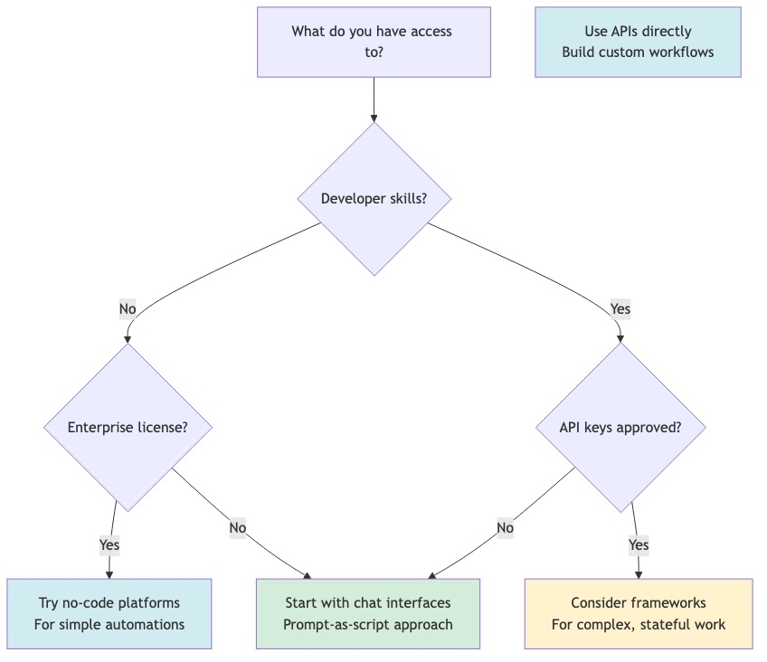

# Tools Landscape

This is not an endorsement list. It's awareness of what exists.

Your choice depends on your constraints: access, budget, skills, compliance requirements. Most readers of this document have significant constraints. That's fine. Start where you can.

## Chat Interfaces (No Setup Required)

These work if you have a browser and an account. Most accessible option for shadow IT environments.

| Tool | Access | Web Search | File Upload | Notes |
|------|--------|------------|-------------|-------|
| Claude (claude.ai) | Free tier + Pro ($20/mo) | Yes | Yes | Strong reasoning, long context |
| ChatGPT | Free tier + Plus ($20/mo) | Yes | Yes | Broad capabilities, plugins |
| Gemini | Free tier + Advanced | Yes | Yes | Google integration |
| Copilot | Free with Microsoft account | Yes | Limited | Integrated with Edge/Windows |

**Best for:** Single-session workflows, prompt-as-script approach, prototyping.

**Limitations:** No persistent memory across sessions, manual copy-paste, no system integration.

## API Access (Developer Required)

If you have developer skills and can get API keys approved, these give you programmatic control.

| Provider | Models | Pricing Model | Notes |
|----------|--------|---------------|-------|
| Anthropic API | Claude family | Per-token | Strong for complex reasoning |
| OpenAI API | GPT family | Per-token | Broad ecosystem, function calling |
| Google AI | Gemini family | Per-token | Long context options |
| AWS Bedrock | Multiple providers | Per-token | Enterprise compliance features |
| Azure OpenAI | GPT family | Per-token | FedRAMP options available |

**Best for:** Production systems, high-volume automation, system integration.

**Limitations:** Requires development skills, security review for API keys, ongoing costs.

## Frameworks (Developer Required)

These provide scaffolding for multi-step, stateful workflows. Useful when you need observability, retry logic, and tool management.

| Framework | Language | Complexity | Best For |
|-----------|----------|------------|----------|
| LangChain | Python/JS | Medium | General-purpose agent building |
| LangGraph | Python | Medium-High | Graph-based workflows, complex branching |
| CrewAI | Python | Medium | Multi-agent role-based systems |
| AutoGen | Python | High | Research, multi-agent conversations |
| Semantic Kernel | C#/Python | Medium | Microsoft ecosystem integration |

**Best for:** Production agents with state management, audit requirements, complex tool orchestration.

**Limitations:** Learning curve, dependency management, overkill for simple tasks.

**Remember:** The patterns these frameworks provide (state, observability, tool contracts) can be implemented without them. Frameworks are shortcuts, not prerequisites.

## No-Code / Low-Code Platforms

For teams without developers who need more than chat interfaces.

| Platform | Access | Best For |
|----------|--------|----------|
| Zapier + AI | Subscription | Simple automations with AI steps |
| Make (Integromat) | Subscription | Visual workflow building |
| Microsoft Power Automate | Enterprise license | Microsoft ecosystem, Copilot integration |
| n8n | Self-hosted or cloud | Open-source workflow automation |

**Best for:** Connecting systems, simple multi-step workflows, non-technical teams.

**Limitations:** Less flexibility than code, vendor lock-in, may not meet compliance requirements.

## Federal/Government Considerations

If you're in a federal environment:

- **FedRAMP:** Azure OpenAI and AWS Bedrock have FedRAMP-authorized options
- **On-premises:** Some organizations are deploying open-source models internally
- **Procurement:** Cloud AI services may require specific contract vehicles
- **Data classification:** Know what data can touch which systems

Check with your IT security and procurement teams before assuming any tool is available to you.

## The Access Reality

For most readers:

| What You Probably Have | What You Probably Don't Have |
|------------------------|------------------------------|
| Personal Claude/ChatGPT account | IT-approved enterprise AI tools |
| Web browser | API access |
| Text editor | Development environment |
| Email | Authority to deploy agents |

Start with what you have. The prompt-as-script approach works with a browser and a free account. That's enough to learn the concepts and prototype solutions.

If you demonstrate value with simple tools, you create the case for more capable infrastructure later.

## Choosing Your Entry Point

Most people should start in the green box. Move to other options when you have a specific reason to.
