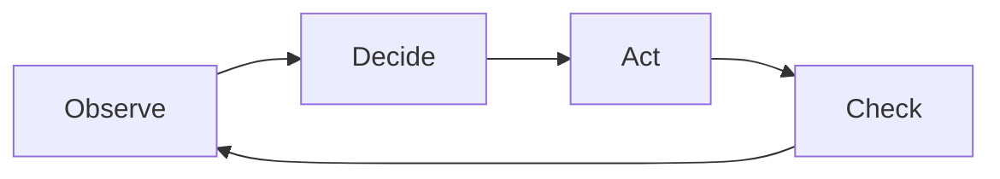
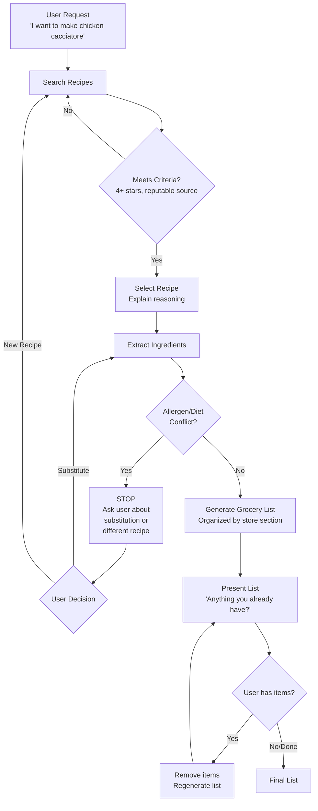
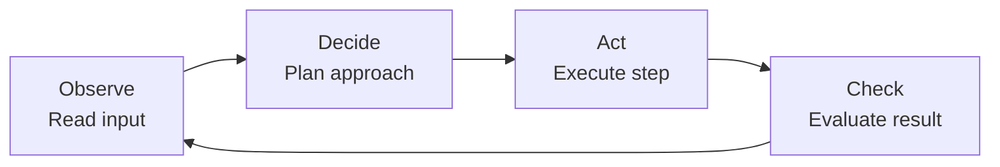
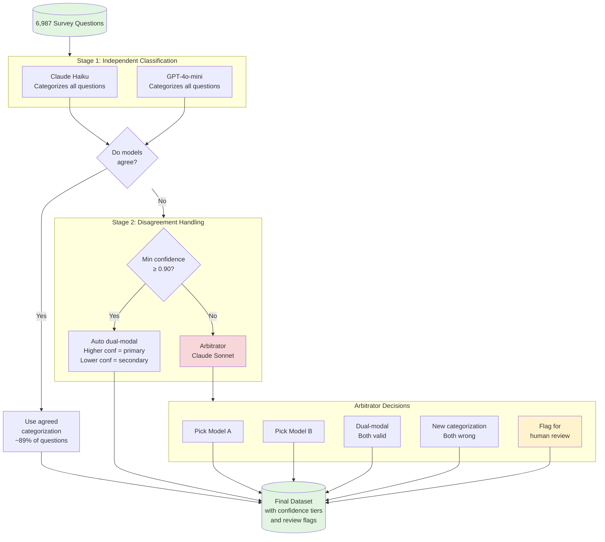
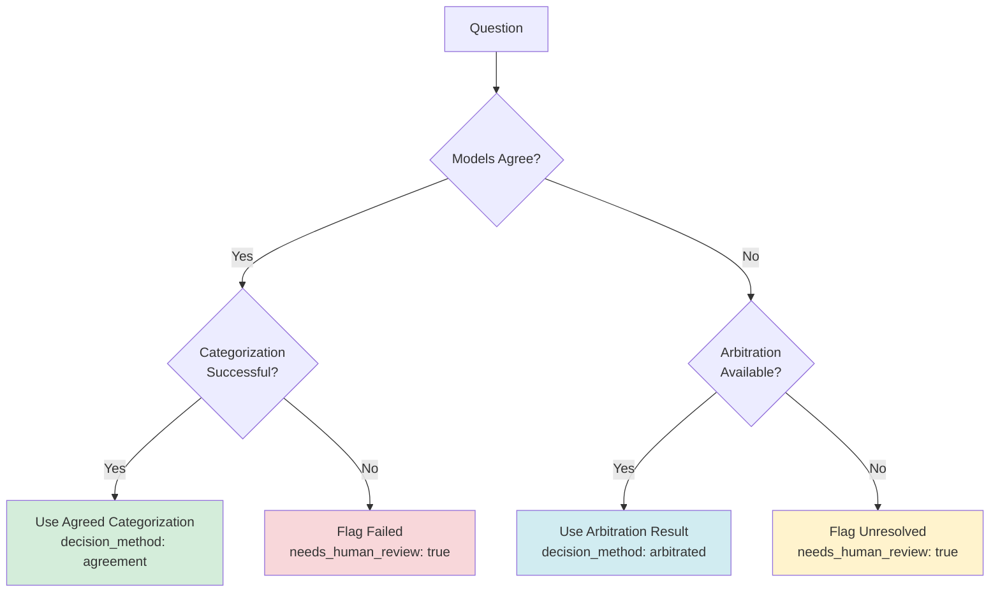
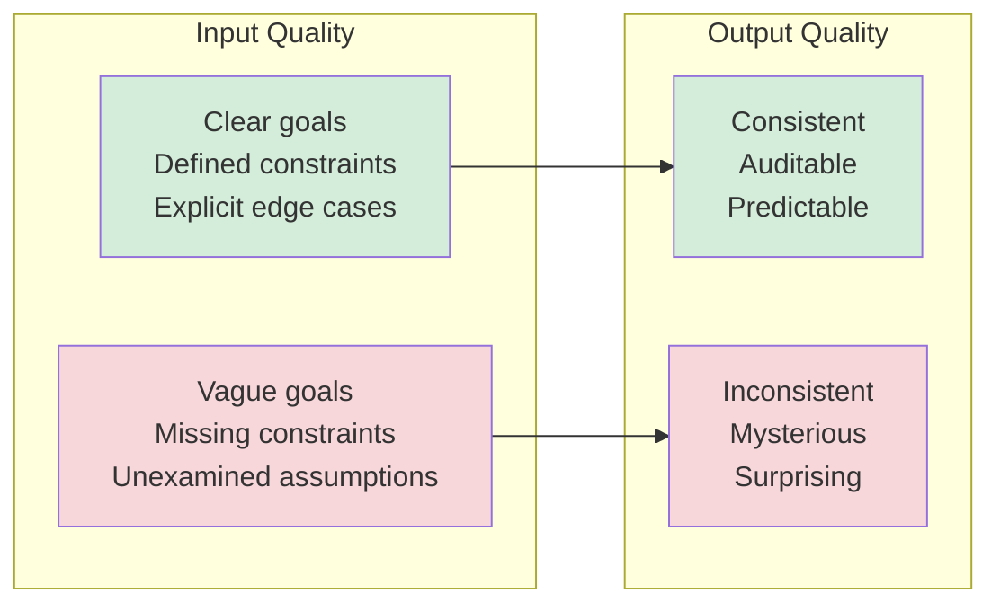
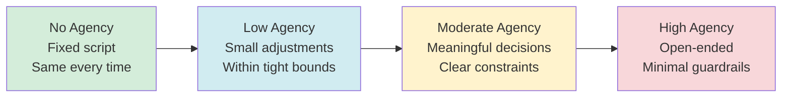
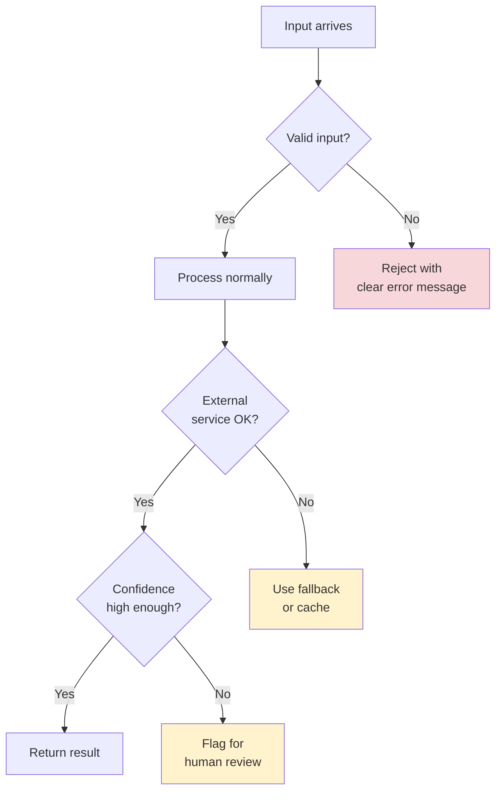
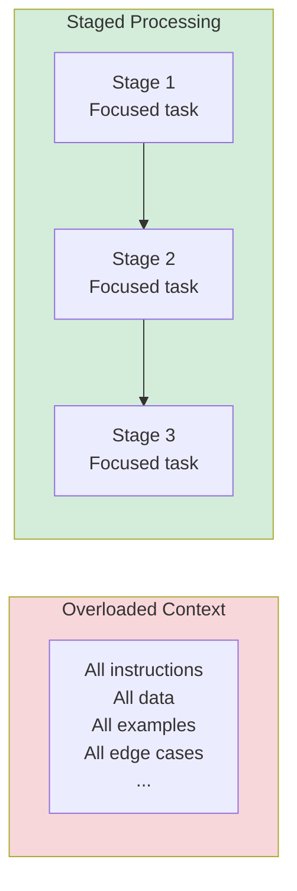
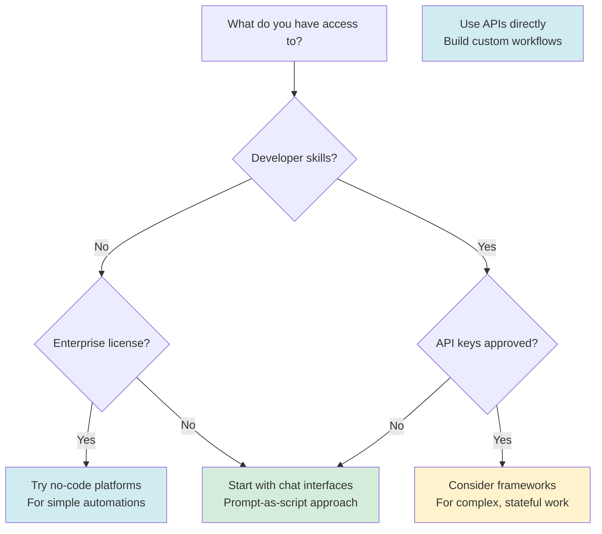

# AI Agents 101: A Practical Guide

**Version:** Draft 0.1  
**Last Updated:** January 2025

---

## Disclaimers

**Living Document**  
This is a working document and has not been finalized. Content is subject to revision.

**Educational Purpose**  
This material is exploratory and educational. Views expressed are the author's own.

**No Endorsements**  
Any use of product or company names does not constitute an endorsement. Tools and platforms are mentioned for awareness only.

**No Organizational Affiliation**  
This document does not represent the official position of any organization. It is intended as speaker's notes and a handout for those interested in learning about and teaching AI agent concepts.

---

## About This Document

This handout accompanies a short presentation on AI agents, agentic behavior, and practical design considerations. It is designed to:

- Establish common vocabulary for discussing AI agents
- Provide concrete examples at increasing levels of complexity
- Stand alone as a reference for those who did not attend the presentation
- Be stolen, shared, and taught from freely

The goal is not mastery — it's baseline understanding and a common language.

---

## How to Use This Document

**If you attended the talk:** Use this as a reference for the concepts discussed. The examples here expand on what was demonstrated.

**If you're reading this cold:** Start with the Executive Summary, then work through the Vocabulary section before diving into examples.

**If you want to teach this material:** Take it. Adapt it. Make it your own. Attribution appreciated but not required.


---

# Executive Summary

This document cuts through AI agent hype to provide practical guidance for federal and enterprise audiences. It establishes common vocabulary, demonstrates working patterns, and offers principles you can apply immediately.

## The Core Message

**Bounded agency beats autonomous agents.**

The fantasy of fully autonomous AI agents running unsupervised is exactly that: fantasy. In practice, production systems in 2025-2026 treat agents as bounded, auditable components with explicit constraints, confidence thresholds, and human oversight points.

This document teaches that approach.

## What You'll Learn

**Vocabulary (Chapter 3):** Precise definitions for workflow, agent, agency, and agentic. These terms get thrown around loosely. Shared definitions prevent confusion.

**Basic Pipeline (Chapter 4):** A recipe-to-grocery-list workflow demonstrating observe-decide-act-check in practice. Simple enough to understand in minutes. Runnable with copy-paste.

**Prompt as Script (Chapter 5):** How to build functional agents without frameworks, APIs, or developer tools. A structured prompt in a chat interface is a legitimate architecture pattern. This matters because most readers can't install software on work computers anyway.

**Case Study (Chapter 6):** The Federal Survey Concept Mapper pipeline. Real federal workflow demonstrating dual-model cross-validation, confidence-based arbitration, and human review fail-safes. Shows bounded agency at production scale.

**Design Principles (Chapter 7):** Six principles that should stay with you:
1. Without good judgment in upfront design, junk probability skyrockets
2. Autonomy is a governance choice, not a technical upgrade
3. Most problems don't need agents (and that's fine)
4. The skill is describing what you want and spotting bad design
5. Design for uncertainty
6. Break tasks into digestible chunks

## Who This Is For

- Federal and enterprise staff exploring AI agent capabilities
- Teams evaluating whether agents fit their workflows
- Non-technical professionals who need to specify and evaluate AI systems
- Anyone tired of hype who wants practical, grounded guidance

## How to Use This Document

**If you have 20 minutes:** Read the vocabulary chapter and skim the design principles.

**If you have an hour:** Work through the basic pipeline and try the prompt yourself.

**If you're implementing:** Use the templates in Appendix B as starting points for your own agent documentation.

## The Bottom Line

You don't need expensive tools or deep technical skills to work with AI agents effectively. You need clear thinking, well-structured prompts, and appropriate skepticism about what automation can and should do.

Start simple. Add complexity only when justified. Design for uncertainty. Keep humans in the loop where it matters.

That's it. The rest is practice.


---

# Introduction

## The Problem: Hype, Confusion, and Expensive Mistakes

AI agents are everywhere right now. Or at least, the *talk* about AI agents is everywhere. LinkedIn is full of people telling you about the "7 types of agents you need to know" or the "ultimate agentic workflow that will 10x your productivity." 

Most of it is noise.

The real problem isn't that agents are overhyped — it's that people are making significant decisions without a shared understanding of what these terms actually mean. When someone says "let's use an AI agent for this," does everyone in the room picture the same thing? Usually not.

This confusion has real costs.

In September 2025, Salesforce cut approximately 4,000 customer support employees — nearly half their support staff — citing their AI product "Agentforce" as the reason. CEO Marc Benioff was explicit: AI was handling the workload, so they needed fewer people. By December, reports emerged that leadership had been "more confident than they should have been" about AI's ability to replace experienced staff. Service gaps, quality issues, and reliability problems followed. They had to walk it back.

Salesforce is a massive company with enormous resources, selling their *own* AI agent product. And they still got caught by the gap between expectations and reality.

## The Journey

```mermaid
flowchart TB
    V[VOCABULARYLearn the terms: workflow, agent, agency, agenticFoundation — everything builds on this]

    B[BASIC PIPELINESee the vocabulary in a simple exampleFirst repetition]

    S[SIMPLE SCRIPTTry it yourself — no API keys, just a promptSecond repetition]

    C[CASE STUDYReal project — design decisions, tradeoffsThird repetition]

    D[DESIGN PRINCIPLESThe "why" behind good agent design]

    R[TOOLS & RESOURCESLandscape awareness, further learning]

    V --> B --> S --> C --> D --> R
```

**The idea:** You'll see the same core concepts three times — each time with more context. By the end, the vocabulary should feel like tools you can use, not jargon to memorize.

## What This Document Provides

This isn't a comprehensive course on building AI agents. It's a practical guide to understanding what people mean when they use these terms, so you can:

- Participate in conversations without getting spun around
- Evaluate claims and cut through marketing hype
- Make better decisions about where agents might (or might not) help
- Know enough to learn more if you want to

We'll cover a small vocabulary, show you what these concepts look like in practice, and give you a concrete example from real work.

## A Note on Expectations

Some limitations of AI agents are temporary — the technology is evolving fast. Other limitations are more fundamental and won't disappear with the next model release. Understanding the difference matters.

If you're curious about this space, now is a reasonable time to start learning. It's easier to grow with the technology than to catch up later. But there's no pressure here. If you dig in and decide this isn't for you, that's fine. There are plenty of useful things to learn in the world. This document will still be here if you want to come back to it.

The goal is a baseline — common vocabulary, a few concrete examples, and enough grounding to make your own decisions.

Let's start with the vocabulary.


---

# Vocabulary

Before diving into examples, we need shared definitions. These terms get thrown around loosely, which creates confusion. Here they are in their "pure" form.

Real-world usage is messier. Everything exists on a spectrum. But you need the baseline definitions before you can navigate the nuance.

## The Core Terms

### Workflow

A workflow is a structure. A container. A defined sequence of steps.

Traditional workflows are static: Step A, then Step B, then Step C. Inputs and outputs are expected and well-defined. If something unexpected happens, the workflow breaks or stops.

Workflows can incorporate agents. When they do, the workflow provides the structure while agents handle the parts that require flexibility or judgment.

**Key point:** A workflow is not an agent. It is the scaffolding that agents can operate within.

### Agent

An agent is an entity that does work.

That's it. The term itself is simple. What varies is how much decision-making authority the agent has.

When you talk to a customer service representative, they're an agent. Some can solve your problem on the spot. Others need to check with their manager for every decision. Both are agents. They differ in how much authority they've been granted.

In AI, an agent is software that can take actions toward a goal. It might be tightly controlled (following explicit rules) or loosely controlled (figuring out its own approach). The degree of control is a design choice.

### Agency

Agency is the grant of decision-making authority.

When you tell a system "when you see X, do Y based on your judgment," you are granting agency. You are delegating a decision.

Agency is not binary. You can grant a little or a lot. You can grant it for specific situations or broadly. The question is always: what decisions are you comfortable delegating, and under what constraints?

### Agentic

Agentic describes behavior where agency is being exercised.

If a system follows the same steps every time regardless of context, it is not acting agentically. If it adjusts its approach based on what it encounters, it is.

**The practical test:** Does the system have flexibility to adapt, or does it execute a fixed recipe?

Agentic is a dial, not a switch. A system can be slightly agentic (making small adjustments within tight bounds) or highly agentic (choosing its own path with minimal constraints). More agentic means more flexibility. It also means less predictability.

### Tool (or Function)

A tool is a single, discrete operation. Query a database. Send an email. Classify a document. Validate a file.

Tools do not set goals. They do not decide what to do next. They execute one specific action when called.

Agents use tools. The agent decides which tool to use and when. The tool just does its job.

## Memory and Context

### Context Window

The context window is the agent's working memory. It is everything the model can "see" at once: the conversation so far, any documents you've provided, system instructions, and the current prompt.

Context windows have hard limits. When you exceed them, content gets truncated or dropped. The model has no awareness of what was cut. It only knows what's currently in the window.

This is why long conversations can feel like the agent "forgot" earlier details. It didn't forget in a human sense. That content simply fell outside the window.

### Context Management

Context management is the practice of working within context window limits. What goes in? What stays out? What gets summarized? What gets stored elsewhere and retrieved when needed?

Good context management is invisible when done well. Bad context management shows up as agents that lose track of instructions, repeat themselves, or miss important details you already provided.

For complex workflows, context management becomes an architectural concern, not an afterthought.

### Memory

Memory in AI systems comes in two forms:

**Short-term memory:** What's currently in the context window. Immediate, accessible, but temporary.

**Long-term memory:** Information persisted outside the context window. Databases, files, vector stores. This information must be explicitly retrieved and loaded into context when needed.

An agent with only short-term memory forgets everything between sessions. An agent with long-term memory can recall past interactions, reference stored knowledge, and maintain continuity over time.

The tradeoff: long-term memory adds complexity. You need systems to store, index, retrieve, and decide what's relevant. More capability, more engineering.

### AGENTS.md (or project instruction files)

AGENTS.md, claude.md, and similar files are a convention for passing persistent instructions to an agent at the project level.

Instead of repeating instructions every conversation, you write them once in a file. The agent reads this file as part of its context, shaping its behavior consistently across sessions.

This is an architectural pattern for managing context and maintaining shared understanding. The file becomes part of the agent's "memory" of how it should behave within a specific project or domain.

Different tools use different filenames (AGENTS.md, claude.md, .cursorrules, etc.), but the concept is the same: instructions that persist across interactions without manual repetition.

## The Loop

At the center of agent behavior is a simple pattern:



**Observe:** Take in information about the current state.

**Decide:** Determine what to do next based on the goal and current state.

**Act:** Execute the chosen action, often by using a tool.

**Check:** Evaluate the result. Is the goal met? Should we continue?

This loop repeats until the goal is achieved, an exit condition is met, or the system gets stuck.

The loop is the heartbeat of agent behavior. Frameworks and tools vary, but this pattern remains constant. If you understand the loop, you understand agents.

## A Note on "Assistants"

You may hear people distinguish between "assistants" and "agents." The typical framing: an assistant waits for your input after every response, while an agent runs autonomously.

This distinction is becoming less useful. Modern reasoning models already deliberate internally, considering approaches and revising their thinking within a single response. The line between "waiting for you" and "acting autonomously" is blurrier than it used to be.

A more useful framing: "assistant" describes an interaction pattern (back-and-forth, human-driven) rather than a fundamentally different kind of system. The same underlying model can behave as an assistant or an agent depending on how you set it up.

For this document, we focus on **workflow**, **agent**, **agency**, and **agentic**. These terms do the most work in clarifying what people actually mean.

## Summary Table

| Term | What It Is | Key Question |
|------|-----------|--------------|
| Workflow | Structure, container, sequence of steps | What's the process? |
| Agent | Entity that does work | What's doing the work? |
| Agency | Granted decision-making authority | What decisions can it make? |
| Agentic | Behavior where agency is exercised | How much can it adapt? |
| Tool | Single discrete operation | What can it do? |
| Context Window | Working memory, finite capacity | What can it see right now? |
| Memory | Short-term (in context) and long-term (persisted) | What can it remember? |
| AGENTS.md | Project-level instruction file | How should it behave here? |


---

# Basic Pipeline Example

This chapter introduces a simple workflow that demonstrates the core concepts in action. The example is intentionally approachable: no domain expertise required, no jargon, something everyone can relate to.

More importantly, the prompt that runs this workflow IS the teaching artifact. When I demo this live, I load this exact text. No magic behind the curtain.

## The Scenario

You want to make dinner. You have a dish in mind but no recipe memorized. You need:

1. A good recipe (not just any recipe, a well-reviewed one)
2. The ingredients extracted as a list
3. A check against any dietary restrictions
4. A shopping list you can actually use

That's a workflow with multiple steps, decisions, and potential stopping points.

## The Workflow



Here's what we're asking the system to do:

**Step 1 - Observe:** User says "I want to make chicken cacciatore."

**Step 2 - Decide:** Find a highly-rated recipe. This is a judgment call. What counts as "highly-rated"? We'll define criteria.

**Step 3 - Act:** Search for recipes, select one that meets criteria, extract ingredients.

**Step 4 - Check:** Does the user have dietary restrictions? Allergies? If the recipe conflicts, stop and ask before proceeding.

**Step 5 - Act:** Generate the grocery list.

**Step 6 - Check:** Present the list. Done.

Notice the pattern? Observe → Decide → Act → Check. That's The Loop from the vocabulary chapter, showing up in practice.

The diagram above shows the full flow, including the decision points (diamonds) where the system exercises judgment and the human checkpoints where it pauses for input. Notice:

- The allergen check is a hard gate. The system cannot proceed without user input.
- The "anything you already have?" step creates a refinement loop.
- Multiple paths exist depending on what happens at each decision point.

This is what distinguishes a workflow with agency from a simple script.

## The Prompt

Here's the actual prompt. This is not pseudocode. This is what you would paste into Claude or another capable model to run this workflow.

```
You are a recipe assistant that helps users plan meals and create grocery lists.

When the user requests a dish:

1. SEARCH for highly-rated recipes (4+ stars, reputable sources like Serious Eats, NYT Cooking, Bon Appétit, or well-reviewed AllRecipes submissions). Prefer recipes with clear ingredient lists and reasonable prep times.

2. SELECT one recipe. Briefly explain why you chose it (rating, source credibility, matches the dish requested).

3. EXTRACT the full ingredient list. Standardize quantities where reasonable (e.g., "1 28-oz can crushed tomatoes" not "one large can tomatoes").

4. CHECK against user's stated dietary restrictions or allergies. If there's a conflict:
   - STOP
   - Explain the conflict clearly
   - Ask if they want a substitution or a different recipe
   - Do not proceed until they respond

5. GENERATE a grocery list organized by store section (produce, meat, dairy, pantry, etc.). Include quantities.

6. ASK: "Anything on this list you already have? Give me the numbers and I'll remove them."

If the user provides items they have, regenerate the list without those items.

---

User dietary restrictions: [none stated yet - ask if unclear]

User request: I want to make chicken cacciatore
```

That's it. That's the whole implementation.

## What Makes This "Agentic"

Look at what this prompt enables:

**Decision points with criteria:** The system decides which recipe to select, but within bounds we defined (4+ stars, reputable sources). It has agency, but constrained agency.

**Conditional branching:** The allergy check creates a hard stop. The system can't just plow through. If there's a conflict, it must pause and ask. That's a governance choice embedded in the workflow.

**Iteration:** The "anything you already have?" step creates a refinement loop. The system doesn't just produce output and walk away. It invites correction.

**Transparency:** "Briefly explain why you chose it" forces the system to show its reasoning. You can evaluate whether the decision was sound.

## What This Is NOT

This is not a fully autonomous agent. It doesn't:

- Run unsupervised for hours
- Make purchases on your behalf
- Manage multi-session state
- Learn from past interactions

It's a single-session workflow with human checkpoints. That's appropriate for this level of complexity. More autonomy requires more guardrails. We'll see those in the case study chapter.

## Running This Live

If you want to demo this yourself:

1. Copy the prompt above
2. Paste it into Claude (or another model with web search capability)
3. Watch it work

The demo IS the documentation. There's no separate "production version" hiding somewhere. What you see is what runs.

Try breaking it:

- Request a dish with an ingredient you're allergic to. Does it catch the conflict?
- Ask for something obscure. How does it handle limited search results?
- Give it a vague request like "something Italian." Does it ask for clarification or guess?

These edge cases reveal where the workflow needs refinement. That's how you iterate toward something robust.

## The Teaching Point

This example demonstrates:

- **Workflow structure:** Defined steps, clear sequence
- **Bounded agency:** The system makes decisions, but within explicit constraints
- **Human-in-the-loop:** Checkpoints where the system pauses for input
- **Transparency:** Reasoning is visible, not hidden

The same pattern scales up. The case study chapter applies it to a federal classification problem with higher stakes, tighter constraints, and more sophisticated uncertainty handling. But the bones are the same.

You now have enough to build something useful. The rest is refinement.


---

# Simple Script: Agent-Lite

Here's the part most courses skip: you don't need frameworks.

No LangChain. No LangGraph. No CrewAI. No visual workflow builders. No API keys. No developer environment.

A reasoning model plus a well-structured prompt is a functional agent. The prompt IS the code.

This matters because most of you can't install software on your work computers anyway. But you can open a browser and paste text.

## The Reality of Shadow IT

Let's be honest about the environment:

- Your IT department hasn't approved any AI tools
- You can't install Python packages or run scripts
- API access requires security reviews that take months
- But you have a personal Claude or ChatGPT account on your phone

That personal account is your development environment. The prompt you paste into it is your program. The conversation is your runtime.

This isn't a workaround. It's a legitimate architecture pattern. You're using a reasoning model as an interpreter for natural language instructions.

## What Makes This Work

Modern reasoning models (Claude, GPT-4, etc.) already have The Loop built in:



When you give a reasoning model a complex task, it doesn't just blurt out an answer. It:

1. Breaks the problem into steps
2. Works through each step
3. Checks its work
4. Adjusts if needed

That's agent behavior. The model is already doing observe-decide-act-check internally. Your prompt shapes what it observes, what decisions it can make, and what actions it can take.

## The Pattern: Prompt as Script

Here's the structure that turns a prompt into a reusable script:

```
## ROLE
[Who the agent is, what it's responsible for]

## CONTEXT  
[Background information, constraints, user preferences]

## WORKFLOW
[Step-by-step process with decision points]

## TOOLS AVAILABLE
[What capabilities the agent can use — web search, file reading, etc.]

## OUTPUT FORMAT
[What the final deliverable looks like]

## GUARDRAILS
[What to do when uncertain, when to stop and ask]

---

[User input goes here]
```

That's it. That's your agent framework. Copy it, fill it in, paste it into Claude or ChatGPT.

## Example: Recipe Assistant as a Script

Here's the recipe workflow from the previous chapter, reformatted as a portable script:

```
## ROLE
You are a recipe assistant that helps users plan meals and create grocery lists.

## CONTEXT
- User may have dietary restrictions or allergies (ask if not stated)
- Prefer well-reviewed recipes from reputable sources
- Goal is a practical, usable shopping list

## WORKFLOW
1. RECEIVE user's dish request
2. SEARCH for highly-rated recipes (4+ stars, sources like Serious Eats, NYT Cooking, Bon Appétit)
3. SELECT one recipe and explain your reasoning (why this one?)
4. EXTRACT ingredients, standardizing quantities
5. CHECK for conflicts with user's dietary restrictions
   - If conflict found: STOP, explain, ask about substitution or new recipe
   - Do not proceed without user confirmation
6. GENERATE grocery list organized by store section (produce, meat, dairy, pantry)
7. ASK what the user already has
8. REGENERATE list excluding those items

## TOOLS AVAILABLE
- Web search (for finding recipes)
- Structured output (for grocery lists)

## OUTPUT FORMAT
Final deliverable is a numbered grocery list organized by store section, with quantities.

## GUARDRAILS
- Never proceed past an allergen conflict without explicit user approval
- If recipe search returns poor results, tell the user and ask for clarification
- If unsure about a dietary restriction, ask rather than assume

---

User dietary restrictions: None stated

User request: I want to make chicken cacciatore
```

Copy that entire block. Paste it into Claude. Watch it run.

## What You Just Built

That prompt is:

- **Portable:** Works in any capable chat interface
- **Versionable:** Save it as a text file, track changes
- **Shareable:** Email it to a colleague, they can run the same workflow
- **Modifiable:** Change the guardrails, adjust the workflow, swap the domain

You didn't install anything. You didn't write code. You didn't need IT approval.

You described what you wanted in structured natural language, and a reasoning model executed it.

## Making It Your Own

The recipe example is intentionally simple. Here's how you adapt the pattern:

**Change the domain:**
- "You are a meeting prep assistant that researches attendees and drafts agendas"
- "You are a policy analyst that summarizes regulations and flags compliance concerns"
- "You are a procurement assistant that compares vendor quotes"

**Adjust the guardrails:**
- More autonomy: "Proceed with best judgment unless cost exceeds $X"
- Less autonomy: "Present three options and wait for selection before proceeding"

**Add context:**
- Paste in relevant background documents
- Include your organization's specific terminology
- Reference previous decisions or preferences

**Specify output format:**
- "Return results as a markdown table"
- "Format as an email draft ready to send"
- "Structure as bullet points for a briefing"

## The Limits

This approach works well for:

- Single-session tasks
- Human-in-the-loop workflows
- Exploratory or ad-hoc work
- Prototyping before building something more robust

It doesn't work well for:

- Multi-day autonomous operation
- Tasks requiring persistent memory across sessions
- High-volume automation (you're manually pasting prompts)
- Anything requiring system integration (databases, APIs, file systems)

For those, you need actual infrastructure. But most people never get there. Most useful work lives in the "paste a prompt, get a result" zone.

## When Frameworks Earn Their Place

To be fair: frameworks like LangChain, LangGraph, and CrewAI exist for real reasons.

They provide scaffolding for:

- **State management:** Tracking where you are in a multi-step workflow
- **Observability:** Logging what happened, when, and why
- **Retry logic:** Handling failures gracefully
- **Tool contracts:** Enforcing preconditions and postconditions on actions

If you're building production systems that need auditability, run unattended, or must comply with regulatory requirements, frameworks can help.

But here's the key insight: **the patterns matter more than the frameworks**.

The FSCM case study in this document implements state management, observability, confidence routing, and tool constraints. It does so with Python scripts, not LangChain. The patterns are the same; the scaffolding is different.

Frameworks are shortcuts to those patterns. They're not prerequisites. If you have developer access and the skills to use them, they can accelerate your work. If you don't, you can still build the same things.

The point isn't "frameworks bad." It's "frameworks aren't the starting line."

## Why This Matters

The gap between "I understand agents conceptually" and "I can build something useful" is smaller than the framework vendors want you to believe.

You don't need:
- A computer science degree
- Python expertise
- API access
- Expensive tooling

You need:
- A clear understanding of what you want
- The ability to break it into steps
- A well-structured prompt
- Access to a reasoning model

That last requirement is the only real barrier. And you probably already have it in your pocket.

## Try It

1. Copy the recipe script above
2. Paste it into Claude or ChatGPT
3. Change "chicken cacciatore" to something you'd actually make
4. Add your real dietary restrictions
5. See what happens

Then modify the script for something work-related. Start small. A single workflow. One decision point. See if it does what you expect.

That's how you learn this: by doing, not by reading about frameworks you'll never install.


---

# Case Study: Federal Survey Concept Mapper

This chapter walks through a real federal workflow that demonstrates bounded agency in practice. Same concepts as the recipe example, but with higher stakes, tighter constraints, and more sophisticated uncertainty handling.

The code is open source: [github.com/brockwebb/federal-survey-concept-mapper](https://github.com/brockwebb/federal-survey-concept-mapper)

## The Problem

The Census Bureau operates dozens of surveys. Each asks questions that overlap, duplicate, or relate to questions in other surveys. Nobody had a comprehensive map of how 6,987 questions across 46 surveys relate to the Bureau's official taxonomy of concepts.

Doing this manually would take hundreds of hours. And humans would disagree with each other constantly about edge cases.

This is a classification problem at scale, with inherent ambiguity.

## The Design Choice

We could have built an "autonomous agent" that categorizes everything and presents final answers. That would be fast and impressive-looking.

It would also be wrong a lot, in ways we couldn't predict or catch.

Instead, we built a **workflow with selective agency**. The system does the heavy lifting, but agency is granted only where it's appropriate, and bounded by explicit constraints.

## The Architecture



Two cheaper models classify independently. When they agree (89% of the time), we use that answer. When they disagree, a more capable model arbitrates.

But the arbitrator isn't autonomous. It has explicit constraints and limited options.

## The Arbitrator: Bounded Agency in Practice

The arbitrator is the only "agentic" component in the pipeline. Here's how its agency is bounded:

**Limited decision space.** The arbitrator can only choose from:
- Pick Model A's answer
- Pick Model B's answer  
- Declare dual-modal (question spans two concepts)
- Propose a new categorization
- Flag for human review

It cannot invent new taxonomy categories. It cannot skip questions. It cannot change the rules.

**Confidence thresholds.** If both models disagree but both have confidence ≥ 0.90, we don't even call the arbitrator. We auto-assign as dual-modal (the question genuinely spans concepts). The arbitrator only sees cases with real uncertainty.

**Mandatory reasoning.** Every decision requires explicit justification. We can audit why any categorization was made.

**Human review flags.** When confidence is too low or the situation is too ambiguous, the system doesn't guess. It flags for human review.

## The Reconciliation Decision Tree

This diagram shows exactly how every question gets resolved:



Notice: **every path has a defined outcome**. There's no ambiguity about what happens. The system either resolves the question or explicitly flags it for human attention.

## Why Two Models?

Using two independent classifiers isn't about "more is better." It serves specific purposes:

**Cross-validation.** When both models agree, confidence is high. When they disagree, we've identified genuine ambiguity.

**Bias reduction.** Each model has blind spots. Two models catch different edge cases.

**Calibration.** Agreement rate tells us how hard the problem is. If models disagree constantly, maybe the taxonomy is flawed.

## Why 0.90 Confidence Threshold?

The threshold isn't arbitrary. It emerged from analysis:

- Below 0.90: genuine uncertainty exists, arbitration adds value
- At or above 0.90: both models are confident in different answers, suggesting the question legitimately spans multiple concepts

The threshold captures ~76% of disagreements for arbitration while auto-resolving the clearest dual-modal cases.

## Results

| Metric | Value |
|--------|-------|
| Questions processed | 6,987 |
| Categorization success rate | 99.5% |
| Model agreement (topic level) | 89% |
| Cohen's Kappa | 0.842 ("almost perfect") |
| Dual-modal questions | ~2.5% |
| Flagged for human review | <1% |
| Total cost | ~$15 |
| Total runtime | ~2 hours |

The system handled 6,987 questions for $15 in two hours. A human team would take weeks and cost thousands.

More importantly: the audit trail is complete. Every decision is traceable. Every edge case is documented.

## What Makes This Different

Compare this to the "autonomous agent" fantasy:

| Autonomous Agent Approach | This Workflow |
|--------------------------|---------------|
| One model decides everything | Cross-validation catches errors |
| Confidence is implicit | Confidence tiers are explicit |
| Edge cases get guessed | Edge cases get flagged |
| Audit trail is murky | Every decision documented |
| Failures are silent | Failures are surfaced |

The workflow is slower to design. It requires thinking through failure modes upfront. But the output is defensible in ways that matter for federal work.

## The Teaching Point

This case study demonstrates:

- **Workflow-first design.** The structure came before the agent. Agency was added only where needed.
- **Bounded agency.** The arbitrator has decision-making power, but within explicit constraints.
- **Confidence thresholds.** Uncertainty is quantified and handled, not hidden.
- **Human review fail-safes.** The system knows when to stop and ask.
- **Auditability.** Every decision can be traced and justified.

The recipe example showed the pattern. This shows the pattern at scale, with the kind of constraints that federal work demands.

You don't need this level of complexity for most problems. But when you do, this is how you build it.


---

# Design Principles

These are the ideas that should stay with you after the vocabulary fades and the examples blur. If you remember nothing else, remember these.

## 1. Without Good Judgment in Upfront Design, Junk Probability Skyrockets

AI doesn't fix bad process. It accelerates it.

If your workflow is poorly defined, an agent will produce poorly defined outputs faster. If your criteria are vague, the agent will make vague decisions at scale. If you haven't thought through edge cases, the agent will hit those edge cases and do something you didn't anticipate.

The quality of agent output is bounded by the quality of agent design. No amount of model capability compensates for unclear instructions, missing constraints, or unexamined assumptions.



**Practical implication:** Spend more time on design than you think you need. The time you "save" by rushing into implementation, you'll spend debugging unexpected behavior.

## 2. Autonomy Is a Governance Choice, Not a Technical Upgrade

Giving an agent more autonomy is not an improvement. It's a tradeoff.

More autonomy means more flexibility. It also means less predictability. The question isn't "how autonomous can we make this?" but "how much autonomy does this task actually require?"

Most tasks don't require much. A well-structured workflow with minimal agency often outperforms a loosely-defined agent with maximum flexibility.

**The dial, not the switch:**



Move right only when you have to. Stay left when you can.

**Practical implication:** Start with the least autonomy that accomplishes the goal. Add agency only when you've identified specific decisions that require it.

## 3. Most Problems Don't Need Agents (And That's Fine)

The hype cycle wants you to believe everything should be agentic. That's marketing, not engineering.

Many problems are better solved with:
- A simple prompt and a copy-paste workflow
- A traditional script with no AI at all
- A human making the decision directly

Agents add value when:
- The task has genuine variability that can't be pre-scripted
- Decisions need to be made at scale
- The cost of human attention exceeds the cost of imperfect automation

If those conditions aren't met, you don't need an agent. You need a simpler solution.

**Practical implication:** Before building an agent, ask: "What's the simplest thing that could work?" Often, that's the right answer.

## 4. The Skill Is Describing What You Want and Spotting Bad Design

You don't need to code to work with agents. But you do need to think clearly.

The core skill is **specification**: being precise about what you want, what constraints apply, what success looks like, and what should happen when things go wrong.

The second skill is **recognition**: looking at an agent workflow and spotting where it's going to fail. Where are the vague instructions? Where are the missing guardrails? Where will edge cases cause problems?

Both skills improve with practice. Neither requires a computer science degree.

**The specification checklist:**

| Question | Why It Matters |
|----------|----------------|
| What's the goal? | Agents need a target |
| What are the constraints? | Bounds prevent chaos |
| What does success look like? | You need to know when you're done |
| What should happen when it's uncertain? | Silence is not a strategy |
| How will you know if it's wrong? | You need feedback loops |

**Practical implication:** Practice writing prompts that are unambiguous. Show them to someone else. If they interpret them differently than you intended, the agent will too.

### Quick Reference: Describing an Agent

When you need to specify what an agent should do, fill in these blanks:

> As a **[role]**, I want the agent to **[narrow outcome]** so that **[business value]**.
>
> The agent is allowed to see: **[systems/data types]**
>
> The agent is allowed to do: **[actions, e.g., propose flags, draft responses]**
>
> The agent must never: **[forbidden actions]**
>
> If the agent is unsure or the decision is high stakes, it must: **[who to ask / how to escalate]**

If you can't fill in every blank, you don't have a clear enough design yet.

### Quick Reference: Reviewing Agent Behavior

When evaluating whether an agent is working correctly, ask these four questions:

1. Did it stay within its job description and data boundaries?
2. Is the action correct in context?
3. Is the rationale understandable?
4. Would I sign my name under this action?

If the answer to any question is "no," mark it as a bad example. Collect these examples. They become your test cases for improving the agent.

## 5. Design for Uncertainty

Things will go wrong. The question is whether you've designed for that possibility.

**Build in checkpoints.** Don't let agents run indefinitely without human visibility. The recipe workflow pauses at the allergen check. The FSCM pipeline flags low-confidence cases. These aren't bugs; they're features.

**Know when it should stop and ask.** An agent that guesses when it's uncertain is worse than useless. Define the conditions under which the agent should halt and request human input.

**Design for what goes wrong, not just what goes right.** Happy path design is easy. Robust design considers: What if the input is malformed? What if the external service is down? What if the model returns garbage? Each failure mode needs a response.



**Practical implication:** For every step in your workflow, ask: "What happens if this fails?" If you don't have an answer, you have a gap.

## 6. Break Tasks Into Digestible Chunks

Context windows have hard limits. More importantly, model performance degrades before you hit those limits.

Stuffing everything into one massive prompt doesn't work. The model loses track, misses instructions, hallucinates connections. Quality suffers even when the task technically "fits."

**The 67-80% rule:** Aim to use 67-80% of available context at most. Leave room for the model to reason. Leave room for your output. Leave room for error.

**Specificity is kindness:** A focused prompt with clear scope outperforms a sprawling prompt that tries to cover everything. If your task is complex, break it into stages. Let each stage do one thing well.



**Practical implication:** If your prompt is getting long and complex, that's a signal to decompose the task, not a challenge to fit more in.

## The Meta-Principle: AI Amplifies Your Process

Good process + AI = faster good outcomes.

Bad process + AI = faster bad outcomes.

AI doesn't relieve you of the need for clear thinking, good documentation, or sound project management. It amplifies whatever you bring to it.

If you're organized, AI helps you move faster. If you're chaotic, AI helps you create chaos at scale.

The fundamentals still matter: know what you're trying to accomplish, break it into manageable pieces, define success criteria, build in feedback loops, document your decisions.

AI is a multiplier. What it multiplies is up to you.

## Summary

| Principle | One-Line Version |
|-----------|------------------|
| 1. Good judgment upfront | Design quality bounds output quality |
| 2. Autonomy is governance | Less autonomy is often better |
| 3. Most problems don't need agents | Simple solutions beat complex ones |
| 4. Specification is the skill | Clarity beats capability |
| 5. Design for uncertainty | Plan for failure, not just success |
| 6. Digestible chunks | Focused beats sprawling |

These principles won't make you an AI expert. They'll help you avoid the mistakes that trip up people who think tools alone are the answer.


---

# Tools Landscape

This is not an endorsement list. It's awareness of what exists.

Your choice depends on your constraints: access, budget, skills, compliance requirements. Most readers of this document have significant constraints. That's fine. Start where you can.

## Chat Interfaces (No Setup Required)

These work if you have a browser and an account. Most accessible option for shadow IT environments.

| Tool | Access | Web Search | File Upload | Notes |
|------|--------|------------|-------------|-------|
| Claude (claude.ai) | Free tier + Pro ($20/mo) | Yes | Yes | Strong reasoning, long context |
| ChatGPT | Free tier + Plus ($20/mo) | Yes | Yes | Broad capabilities, plugins |
| Gemini | Free tier + Advanced | Yes | Yes | Google integration |
| Copilot | Free with Microsoft account | Yes | Limited | Integrated with Edge/Windows |

**Best for:** Single-session workflows, prompt-as-script approach, prototyping.

**Limitations:** No persistent memory across sessions, manual copy-paste, no system integration.

## API Access (Developer Required)

If you have developer skills and can get API keys approved, these give you programmatic control.

| Provider | Models | Pricing Model | Notes |
|----------|--------|---------------|-------|
| Anthropic API | Claude family | Per-token | Strong for complex reasoning |
| OpenAI API | GPT family | Per-token | Broad ecosystem, function calling |
| Google AI | Gemini family | Per-token | Long context options |
| AWS Bedrock | Multiple providers | Per-token | Enterprise compliance features |
| Azure OpenAI | GPT family | Per-token | FedRAMP options available |

**Best for:** Production systems, high-volume automation, system integration.

**Limitations:** Requires development skills, security review for API keys, ongoing costs.

## Frameworks (Developer Required)

These provide scaffolding for multi-step, stateful workflows. Useful when you need observability, retry logic, and tool management.

| Framework | Language | Complexity | Best For |
|-----------|----------|------------|----------|
| LangChain | Python/JS | Medium | General-purpose agent building |
| LangGraph | Python | Medium-High | Graph-based workflows, complex branching |
| CrewAI | Python | Medium | Multi-agent role-based systems |
| AutoGen | Python | High | Research, multi-agent conversations |
| Semantic Kernel | C#/Python | Medium | Microsoft ecosystem integration |

**Best for:** Production agents with state management, audit requirements, complex tool orchestration.

**Limitations:** Learning curve, dependency management, overkill for simple tasks.

**Remember:** The patterns these frameworks provide (state, observability, tool contracts) can be implemented without them. Frameworks are shortcuts, not prerequisites.

## No-Code / Low-Code Platforms

For teams without developers who need more than chat interfaces.

| Platform | Access | Best For |
|----------|--------|----------|
| Zapier + AI | Subscription | Simple automations with AI steps |
| Make (Integromat) | Subscription | Visual workflow building |
| Microsoft Power Automate | Enterprise license | Microsoft ecosystem, Copilot integration |
| n8n | Self-hosted or cloud | Open-source workflow automation |

**Best for:** Connecting systems, simple multi-step workflows, non-technical teams.

**Limitations:** Less flexibility than code, vendor lock-in, may not meet compliance requirements.

## Federal/Government Considerations

If you're in a federal environment:

- **FedRAMP:** Azure OpenAI and AWS Bedrock have FedRAMP-authorized options
- **On-premises:** Some organizations are deploying open-source models internally
- **Procurement:** Cloud AI services may require specific contract vehicles
- **Data classification:** Know what data can touch which systems

Check with your IT security and procurement teams before assuming any tool is available to you.

## The Access Reality

For most readers:

| What You Probably Have | What You Probably Don't Have |
|------------------------|------------------------------|
| Personal Claude/ChatGPT account | IT-approved enterprise AI tools |
| Web browser | API access |
| Text editor | Development environment |
| Email | Authority to deploy agents |

Start with what you have. The prompt-as-script approach works with a browser and a free account. That's enough to learn the concepts and prototype solutions.

If you demonstrate value with simple tools, you create the case for more capable infrastructure later.

## Choosing Your Entry Point



Most people should start in the green box. Move to other options when you have a specific reason to.


---

# Resources

## In This Document

**Appendix: Research Findings**
Summary of 2025-2026 research and industry practice on bounded agents, confidence thresholds, human-in-the-loop patterns, and teaching non-technical staff. Includes source citations.

**Appendix: Implementation Templates**
Copy-paste ready templates for practitioners:
- Agent Mission & Scope one-pager
- Process Map Worksheet
- Tool Catalog & Policy Sheet
- Risk & Human-Oversight Checklist
- Evaluation Sheet
- Change Log Template
- Non-Technical Training Handouts

## Case Study Source Code

The Federal Survey Concept Mapper pipeline referenced in Chapter 6:

**Repository:** [github.com/brockwebb/federal-survey-concept-mapper](https://github.com/brockwebb/federal-survey-concept-mapper)

Demonstrates:
- Dual-model cross-validation
- Confidence-based arbitration
- Human review flags
- Complete audit trails

## Further Reading

### On Agent Design Patterns

- Anthropic's documentation on tool use and agent patterns: [docs.anthropic.com](https://docs.anthropic.com)
- OpenAI's guide to function calling: [platform.openai.com/docs](https://platform.openai.com/docs)

### On AI Governance

- NIST AI Risk Management Framework: [nist.gov/itl/ai-risk-management-framework](https://www.nist.gov/itl/ai-risk-management-framework)
- World Economic Forum, "AI Agents in Action: Foundations for Evaluation and Governance" (2025)

### On Prompt Engineering

- Anthropic's prompt engineering guide: [docs.anthropic.com/en/docs/build-with-claude/prompt-engineering](https://docs.anthropic.com/en/docs/build-with-claude/prompt-engineering)

### On Critical Thinking with AI

- Microsoft Research on AI and critical thinking (2025)
- "Ultra-Processed Minds" by Carl Hendrick (2025) on deep reading in the AI era

## Key Sources for This Document

Research findings in the appendix draw from:

- arxiv.org/pdf/2601.08815.pdf (Resource-bounded agents)
- machinelearningmastery.com/7-agentic-ai-trends-to-watch-in-2026/
- detectionatscale.com/p/ai-security-operations-2025-patterns
- kore.ai/blog/ai-agents-in-2026-from-hype-to-enterprise-reality
- o-mega.ai/articles/langgraph-vs-crewai-vs-autogen-top-10-agent-frameworks-2026
- elearningindustry.com/how-no-code-and-agentic-ai-are-transforming-team-training-platforms-in-2026

## Contact

This document is maintained at: [github.com/brockwebb/ai-demos/ai_agents_101](https://github.com/brockwebb/ai-demos)

Feedback, corrections, and contributions welcome.

---

*This is a living document. Content reflects understanding as of January 2026.*


---

# Appendix: Research Findings

This appendix summarizes 2025-2026 research and industry practice on AI agent design, compiled to validate and inform the guidance in this document.

## Key Findings

### Bounded vs Autonomous Agents

Industry consensus in 2025-2026 favors **bounded autonomy** over fully autonomous agents, especially where safety, auditability, or regulatory compliance matter.

Common patterns:
- **Action-level constraints:** Agents scoped to narrow domains with explicit action contracts (what they can read, write, and call)
- **Runtime governance:** Monitoring and "governance agents" that watch for policy violations or anomalous behavior
- **Step-wise autonomy:** Systems start with low-risk tasks and only escalate to higher-risk actions after human-validated pilots

Government-style guidance (e.g., NIST-aligned AI-risk frameworks) now treats **unbounded agents as high-risk by default**, pushing toward resource-bounded, contract-driven architectures.

*Sources: arxiv.org/pdf/2601.08815.pdf, moveworks.com, machinelearningmastery.com, solutionsreview.com*

### When NOT to Use Agents

Growing consensus that many use cases are better served by simpler patterns:

- **Deterministic workflows:** If logic is stable and inputs are structured, use rule engines or scripts
- **Low-variability tasks:** Simple classification, templated responses, or static retrieval work fine with well-prompted LLM calls
- **High-risk, low-frequency decisions:** For rare, high-impact decisions, use human-driven workflows with AI assistance

Practitioner maxim: **"Start at the lowest level of sophistication that solves the problem; upgrade only when data and feedback justify it."**

*Sources: linkedin.com (Santiago Valdarrama), kore.ai*

### Human-in-the-Loop Patterns

HITL is moving from binary approval gates to **risk- and confidence-aware patterns**:

**Confidence-based routing:**
- Route to humans when confidence scores fall below threshold (typically 0.7-0.8)
- Route when uncertainty metrics (entropy, conflicting plans) exceed bounds

**Risk-tiered autonomy:**
- Low risk: Agents act autonomously (triage, enrichment)
- Medium risk: Agent proposes, human approves
- High risk: Human initiates, agent assists

**Calibration loops:**
- Log human overrides
- Periodically adjust thresholds
- Retrain confidence estimators

Security and fraud teams describe **"crawl-walk-run" autonomy ladders**: agents first summarize, then suggest, then (only in high-confidence cases) auto-remediate.

*Sources: detectionatscale.com, machinelearningmastery.com*

### Prompt-Based vs Framework Approaches

The trade-off is framed as **flexibility vs maintainability**:

**Prompt-based workflows best for:**
- Short, stateless tasks
- Rapid prototyping
- Low-stakes experimentation

**Framework-dependent agents (LangChain, LangGraph, CrewAI) best for:**
- Multi-step, stateful workflows
- Use cases where auditability, retry logic, and observability matter
- Compliance-sensitive tasks

Practitioner heuristic: **"Use prompt-only for exploratory and low-stakes tasks; use frameworks once workflows become stateful, multi-step, or regulated."**

Note: The patterns that frameworks provide (state management, tool contracts, observability) can also be implemented without frameworks. Frameworks provide scaffolding; they're not prerequisites.

*Sources: o-mega.ai, solutionsreview.com*

### Teaching Non-Technical Staff

Training non-technical staff leans on **no-code/low-code platforms plus structured heuristics**:

**Workflow-first approach:**
- Map existing manual processes into steps, decisions, handoffs
- Identify bottlenecks agents could relieve

**Evaluation heuristics for non-technical teams:**
- Action correctness: Did the agent do the right thing?
- Risk containment: Did it stay within permissions?
- Human-experience impact: Did it reduce or create cognitive load?

**Structured feedback loops:**
- Log edge cases
- Flag over-confidence
- Refine guardrails based on collected examples

*Sources: elearningindustry.com, kore.ai*

## Recommended Artifacts Per Agent

Industry practice suggests standardizing on five short artifacts per agent/workflow:

1. **Mission + scope one-pager** (including risk tier and autonomy mode)
2. **Process map** with agent steps and human-in-the-loop points marked
3. **Tool catalog** with each tool's preconditions, postconditions, and permissions
4. **Evaluation sheet** with target metrics and sampling strategy
5. **Change log** tracking prompt/workflow/model changes and measured impact

## Alignment with This Document

The guidance in this document aligns with 2025-2026 research consensus on:

- Bounded agency over full autonomy
- Confidence thresholds for human routing
- Risk-tiered autonomy levels
- "Start simple, add complexity only when justified"
- Workflow-first design approach
- Teaching specification skills over framework mechanics

The FSCM case study demonstrates these patterns in a federal context: dual-model cross-validation, confidence-based arbitration, explicit human review flags, and complete audit trails.

## Sources

- arxiv.org/pdf/2601.08815.pdf (Resource-bounded agents)
- moveworks.com/resources/blog/agentic-ai-vs-ai-agents-definitions-and-differences
- machinelearningmastery.com/7-agentic-ai-trends-to-watch-in-2026/
- solutionsreview.com/ai-and-enterprise-technology-predictions-from-industry-experts-for-2026/
- detectionatscale.com/p/ai-security-operations-2025-patterns
- kore.ai/blog/ai-agents-in-2026-from-hype-to-enterprise-reality
- linkedin.com (Santiago Valdarrama on agent overuse)
- o-mega.ai/articles/langgraph-vs-crewai-vs-autogen-top-10-agent-frameworks-2026
- elearningindustry.com/how-no-code-and-agentic-ai-are-transforming-team-training-platforms-in-2026


---

# Appendix: Implementation Templates

These templates are for practitioners ready to implement. Copy, adapt, and use.

They align with 2025-2026 industry practice for bounded AI agents in enterprise and government settings.

---

## 1. Agent Mission & Scope One-Pager

**Title:** `[Agent Name] – Mission & Scope`

### 1. Mission (1-2 sentences)
- Purpose: What this agent is for, in business terms.
- Example: "Assist survey analysts by flagging inconsistent records and drafting human-readable rationales; never modify source data."

### 2. Intended Users & Context
- Primary users/teams:
- Processes this agent supports:
- Systems it interfaces with:

### 3. Risk Tier & Autonomy Mode

**Risk tier:** ☐ Low ☐ Medium ☐ High

Explain why, referencing impact on people/resources/compliance.

**Autonomy mode** (pick one per main action type):
- ☐ Auto-execute (low risk, reversible)
- ☐ Suggest-then-approve (human must approve)
- ☐ Human-initiated, agent-assisted (agent only helps)

### 4. Scope – What the Agent May / May Not Do

**May access** (data domains, systems, fields):
- Example: "Read-only access to survey response tables and codebooks; no access to PII beyond [fields]."

**May take actions** (verbs):
- Example: "Propose edit flags, draft rationales, draft emails for analysts to send."

**Must not do:**
- Example: "Cannot commit edits to production DB, cannot send external emails, cannot change weights or imputation parameters."

### 5. Guardrails & Constraints

- Policy constraints (legal, statistical, confidentiality):
- Technical constraints (rate-limits, step-limits, tool whitelist):
- Oversight mechanisms:
  - Who reviews outputs?
  - How are overrides logged?

### 6. Success Criteria & Metrics

- Primary success metrics (e.g., precision/recall vs. human baseline, time saved, override rate):
- Target thresholds (e.g., "≥90% of auto-flags accepted by analysts on low-risk categories"):

---

## 2. Process Map Worksheet

**Title:** `[Workflow Name] – AI-Augmentation Worksheet`

Use with field reps, analysts, or program staff in a workshop setting.

### Step 1 – Describe the current process

| Step ID | Step Name | Who Does It? | Inputs | Outputs | Risk Tier (L/M/H) |
|---------|-----------|--------------|--------|---------|-------------------|
| | | | | | |
| | | | | | |
| | | | | | |

### Step 2 – Identify candidate "AI spots"

| Step ID | Repetitive? (Y/N) | Heavy Reading/Context? (Y/N) | Could AI Help? (Describe) |
|---------|-------------------|------------------------------|---------------------------|
| | | | |
| | | | |
| | | | |

Highlight rows with many "Y" answers. These are candidates for AI augmentation.

### Step 3 – Assign minimal technology

| Step ID | Pattern | Tech Choice |
|---------|---------|-------------|
| | A – LLM as lens (summarize/explain) | Prompt-only / RAG |
| | B – LLM as recommender (flags, routing) | Prompt-only initially; bounded agent if multi-step |
| | C – LLM as actor (tool calls) | Bounded agent via framework |

---

## 3. Tool Catalog & Policy Sheet

**Title:** `[System Name] – AI Tool Catalog`

For each tool callable by any agent:

| Field | Description |
|-------|-------------|
| Tool ID | Unique identifier |
| Name | Human-readable name |
| Description | What it does |
| Allowed agents/roles | Who can call this tool |
| Inputs (schema) | Expected input format |
| Outputs (schema) | Expected output format |
| Preconditions | Business rules and access policies (e.g., "only for de-identified records") |
| Postconditions | What must be true after the tool runs (e.g., "ticket updated with timestamp") |
| Risk tier | Low/Medium/High |
| Logging requirements | What must be captured for audit |

**Guidance:**
- Preconditions: business rules and access policies
- Postconditions: what must be true after the tool runs
- Logging requirements: what must be captured for audit (actor, time, inputs, outputs, decision rationale)

---

## 4. Risk & Human-Oversight Checklist

**Title:** `[Agent Name] – Risk & Human-Oversight Checklist`

Use as a yes/no checklist before deployment.

### A. Impact & Compliance

- [ ] Have we run an AI impact/risk assessment referencing NIST AI RMF or similar?
- [ ] Are individuals' rights, benefits, or obligations affected by this agent's outputs?
- [ ] If yes, is the agent classified as high-risk under any applicable law or internal standard?

### B. Human Oversight Design

- [ ] For high-risk decisions, does a human review outputs before execution?
- [ ] Can a human override or ignore the agent's suggestions at any time?
- [ ] Is there a documented escalation path for appeals or contested decisions?
- [ ] Do users understand the agent's limitations and know they're interacting with AI?

### C. Confidence & Routing

- [ ] Does the agent produce a confidence score or uncertainty marker for key actions?
- [ ] Are there explicit thresholds where outputs must be sent to a human (e.g., confidence <0.75)?
- [ ] Are specific keywords/patterns (e.g., "appeal", "fraud") always routed to human review?

### D. Logging & Traceability

- [ ] Are all actions logged with: agent ID, tool ID, inputs, outputs, timestamps, user IDs?
- [ ] Can we reconstruct the sequence of steps that led to any given decision?
- [ ] Is there a rollback or kill-switch mechanism?

---

## 5. Evaluation Sheet

**Title:** `[Agent/Workflow Name] – Evaluation Plan`

### 1. Objectives

What are we trying to improve?
- Example: reduce analyst time per flagged case, improve precision of flags, shorten resolution time

### 2. KPIs and Targets

| Metric | Definition | Target |
|--------|------------|--------|
| | | |
| | | |
| | | |

Common metrics:
- Accuracy/precision/recall vs. human gold-standard
- Override rate (how often humans reject agent suggestions)
- Time saved per case

### 3. Offline Test Set

- Source (e.g., past cases with known decisions):
- Size and sampling strategy:
- Red-team cases (deliberately hard or adversarial examples):

### 4. Online Monitoring

- What do we log live?
- How often do we re-evaluate metrics and thresholds?

### 5. Acceptance Criteria

Example: "We will move from suggest-only to auto-execute for low-risk actions when: precision ≥X%, override rate ≤Y% for Z weeks."

---

## 6. Change Log Template

**Title:** `[Agent/Workflow Name] – Change Log`

| Date | Change Type | Description | Reason | Affected Metrics/Risks | Owner | Status |
|------|-------------|-------------|--------|------------------------|-------|--------|
| | prompt/model/workflow/tool/policy | | | | | planned/rolled out/rolled back |
| | | | | | | |
| | | | | | | |

Keep changes auditable and link them to evaluation results and risk assessments.

---

## 7. Non-Technical Training Handouts

### Handout A – "How to Describe a Good Agent"

Fill in the blanks:

> As a **[role]**, I want the agent to **[narrow outcome]** so that **[business value]**.
>
> The agent is allowed to see: **[systems/data types]**
>
> The agent is allowed to do: **[actions, e.g., propose flags, draft responses]**
>
> The agent must never: **[forbidden actions]**
>
> If the agent is unsure or the decision is high stakes, it must: **[who to ask / how to escalate]**

### Handout B – "How to Review Agent Behavior"

For any agent suggestion, ask:

1. Did it stay within its job description and data boundaries?
2. Is the action correct in context?
3. Is the rationale understandable?
4. Would I sign my name under this action?

If "no" to any, mark as **"bad example"** and send to the technical team with a screenshot or copy. This creates a growing test set for evaluation.

---

## Using These Templates

**Minimum viable documentation** for any agent:

1. Mission & Scope one-pager (Template 1)
2. Risk & HITL checklist completed (Template 4)
3. Change log started (Template 6)

**For production agents, add:**

4. Tool catalog for all callable tools (Template 3)
5. Evaluation plan with offline test set (Template 5)

**For workshop-based design with non-technical staff:**

- Process Map Worksheet (Template 2)
- Training Handouts A & B (Template 7)

These templates encode the same principles described in this document: bounded agency, confidence-based routing, human oversight, and auditability.


---

