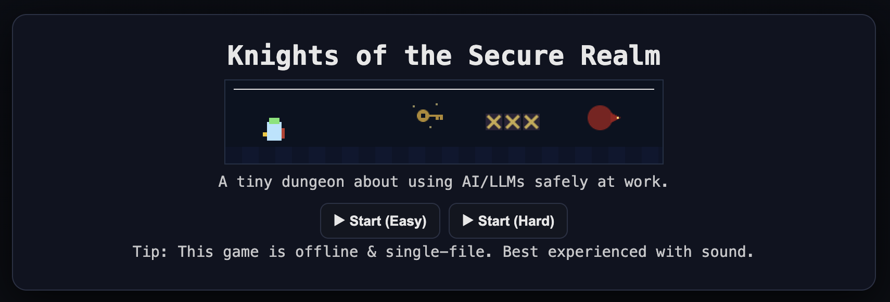

# Knights of the Secure Realm

## Why Play?

**Knights of the Secure Realm** is more than just a retro-style maze adventure — it’s an **educational learning tool in a fun, interactive format**.
The goal: teach employees and teams how to use AI/LLM tools **securely** at work.
Players learn key security concepts such as data redaction, least privilege, oversight, guardrails, and injection safety — all while exploring a dungeon, collecting magical gear, and defeating a dragon.

## What It Is

This game is a **self-contained HTML + JavaScript** file, with:

* No external dependencies or network calls.
* Designed to run locally or in more locked-down environments (e.g., on a SharePoint site).
* A “retro” feel with simple tile graphics and light 8-bit audio.
* Easy and hard modes (question difficulty changes, mechanics stay the same).

## How to Play

1. **Download the game file**:
   [knights\_of\_the\_secure\_realm.html](https://github.com/brockwebb/ai-demos/blob/main/knights_of_the_secure_realm/knights_of_the_secure_realm.html)
2. Download the 'raw file' (upper right corner of the window)
3. Open it in your web browser.
4. Use arrow keys to navigate the maze, visiting each training room to answer a question and earn gear.
5. Collect all five gear pieces to unlock the key.
6. Use the key to open the gate to the dragon’s lair.
7. Defeat the dragon by answering **at least 4 out of 5** final questions correctly.

## Learning Outcomes

By playing, users will:

* Recognize safe vs. unsafe ways to share information with AI tools.
* Understand the principle of least privilege.
* Learn the importance of oversight and guardrails.
* Identify and avoid prompt injection attacks.

---
Note: 
- This is a prototype for fun and was never intended to be a major quest or game, but rather to show the potential of what could be created.
- This was created with ChatGPT5 and took about 9 iterations, starting simple, testing, and adding features to get to an acceptable MVP.

If you want, I can also **add a short animated GIF** of gameplay to the `images` folder and embed it here so people see movement right away when they open the repo page. That could make it even more enticing.
