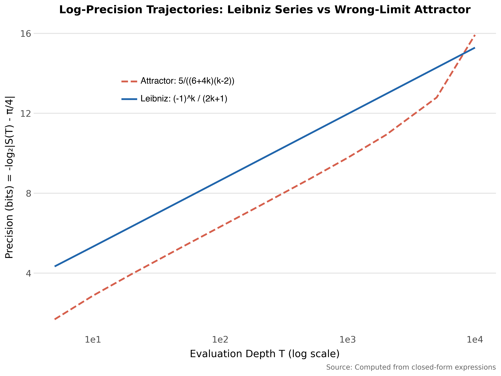
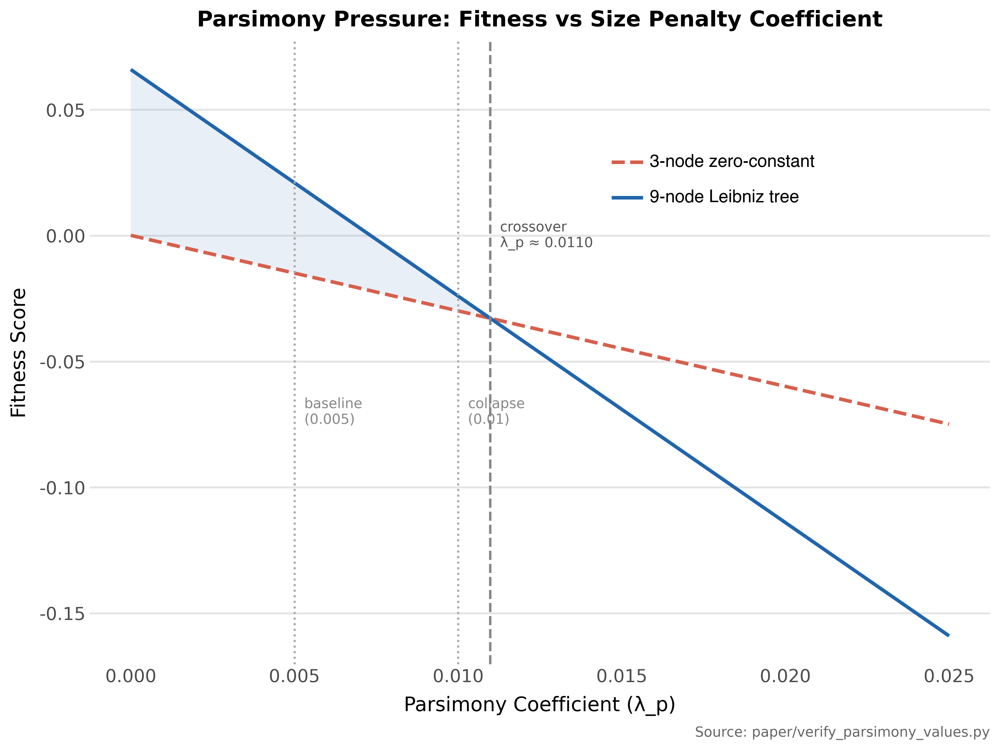
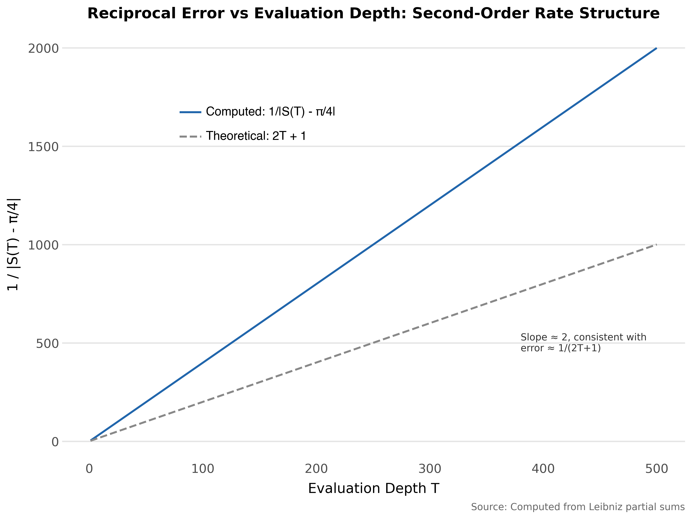

# Introduction

Every AI system is evaluated within a finite horizon. Training runs end, test sets have boundaries, and context windows close. This is not a defect in any particular architecture. The constraint is structural, arising from how we build and test all of them. Any search process evaluated within a finite horizon will find outputs that look correct inside that horizon. Whether those outputs remain correct beyond it is a question that finite evaluation cannot answer.

You cannot close that gap by designing a better test. You can only manage it by constraining the search space. This paper demonstrates that mechanism, gives it a name, and shows through a controlled experiment what works and what does not.

We call these failures *wrong-limit attractors*: outputs of a search process that appear to converge toward a target value within the evaluation horizon but whose long-term behavior is unknown. They could plausibly converge to the target. They could converge to a nearby but different value. They could eventually diverge. Without carrying evaluation to the limit, we cannot distinguish these cases.

They are not overfitting: they genuinely appear to converge. They are not noise: they are structurally coherent. They are not evaluation function errors: the evaluation correctly ranks the right answer above them when both are present. Wrong-limit attractors arise because the gap between finite observation and infinite-horizon behavior is not closable by finite means. As the search space grows, outputs consistent with the target within the evaluation horizon multiply combinatorially while the actual target remains a single point. At some point, the difference between the target and a wrong-limit attractor's trajectory may fall below the resolution of the evaluation instrument, and the distinction becomes unmeasurable. The problem lives in the space between that resolution floor and the evaluation horizon: deviations large enough to matter, too small to detect within the horizon.

We study this through a clean, controlled case: can genetic programming rediscover the Leibniz series for π/4 from arithmetic primitives alone?

$$\frac{\pi}{4} = \sum_{k=0}^{\infty} \frac{(-1)^k}{2k+1} = 1 - \frac{1}{3} + \frac{1}{5} - \frac{1}{7} + \cdots$$

The series converges to π/4 but does so slowly, gaining roughly 3.32 bits of precision per decade of terms. Leibniz is an ideal laboratory: the target is known exactly, the search space is enumerable, the failure mode is quantifiable, and success or failure is binary. We develop two fitness functions that evaluate convergence behavior across evaluation depths rather than pointwise accuracy, motivated by an analogy to reaction kinetics developed in Section 6.1. Both correctly identify Leibniz as optimal when it is present. We demonstrate this in a controlled setting where the failure mode can be quantified exactly. The structural argument extends to any finite-horizon evaluation of infinite-horizon processes.

Discovery exhibits a sharp phase transition as the search space grows. With 4 arithmetic primitives, discovery is reliable: 19 of 20 seeds found Leibniz across all tested population sizes. With 15 primitives, discovery fails completely despite the fitness function still ranking Leibniz as optimal. Seven modifications to the fitness function all failed at 15 primitives. Increasing the population by 10x did not shift the failure boundary. Extending the time budget by 4x did not rescue discovery.

The bottleneck is not the fitness landscape, which places Leibniz at its global optimum. The bottleneck is coverage: the probability that the correct building blocks appear in the population before wrong-limit attractors dominate. After correcting an initial methodological confound in which the target expression was inadvertently seeded in the population (Section 4.1), all experiments use pure random initialization. The failure conditions are more instructive than the success.

This failure mode is not specific to genetic programming or to the Leibniz problem. Any system that evaluates process behavior within a finite horizon faces the same structural constraint.

In reinforcement learning, policies optimized over finite episodes can exploit the reward structure within the evaluation horizon without learning genuinely reliable behavior [@Amodei2016ConcreteProblems]. In large language models, training against finite context windows creates the conditions for confabulation [@Ji2023Hallucination; @NIST2024AI600]. The resulting outputs appear well-formed and plausible within the training distribution but do not correspond to truth. In symbolic regression, pointwise fitness creates wrong-limit attractors for any problem involving convergence, stability, or asymptotic behavior. The common structure is that finite evaluation of infinite-horizon processes creates a space of outputs that are indistinguishable from the correct answer within the evaluation horizon. The lever that matters is not a better evaluation function but a more constrained search space.

Section 2 reviews related work on symbolic regression and process-level fitness design. Sections 3 and 4 describe the GP engine, fitness functions, and experimental design, including terminal set construction and the scaling grid. Section 5 presents results: the phase transition, wrong-limit attractor families, parsimony effects, and threshold sensitivity. Sections 6 and 7 discuss the kinetics connection, the confabulation analogy, implications for symbolic regression, and conclude.

# Background and Related Work

## Symbolic Regression

Symbolic regression searches for mathematical expressions that fit data, discovering both the functional form and its parameters simultaneously. Unlike conventional regression, which assumes a model structure and optimizes coefficients, symbolic regression explores the full space of compositions over a given operator and terminal set.

@Schmidt2009Distilling showed that GP-based symbolic regression could recover Hamiltonians and Lagrangians from experimental data. Their result was widely interpreted as evidence that symbolic regression extracts natural laws without domain knowledge. @Hillar2012Comment subsequently demonstrated that the fitness function implicitly encoded Hamilton's equations, so that high-fitness expressions were Hamiltonians by construction. The "laws" were not discovered from scratch; the fitness measure already contained classical mechanics. This critique parallels our own injection confound (Section 4.1). Seeding the initial population with the target formula created the illusion of discovery; the formula was merely preserved through elitism.

Modern symbolic regression spans evolutionary [@Cranmer2023PySR], transformer-based [@Valipour2021SymbolicGPT], neural-symbolic, generative flow [@Li2023GFlowNet], tree-search [@Kamienny2023MCTS; @Shojaee2023TPSR], and equality saturation approaches [@Jiang2025EGGSR].
All of these systems optimize pointwise fitness: they minimize error between predicted and observed values at discrete (x, y) pairs. None address the problem class we consider, evaluating convergence properties of an infinite-horizon generating process against a known limit.

## Fitness Design for Convergent Processes

The standard symbolic regression fitness is root-mean-square error between predicted and observed outputs. Pareto-based approaches add complexity as a second objective. Parsimony pressure (λ_p, a size penalty on expression trees), penalizing expression size, is the simplest form.

For infinite-horizon convergent processes, pointwise fitness is insufficient. A series that sums to a value near π/4 at T=10,000 terms would score well on pointwise accuracy but has no structural relationship to Leibniz. The fitness must instead evaluate how partial sums *behave* across evaluation depth. Does error decrease monotonically? Is the rate of improvement sustained? Does the precision gain follow a predictable scaling law?

Prior symbolic regression work does not address fitness design for this objective class. The closest analog is time-series forecasting, where models are evaluated on multi-step-ahead prediction quality rather than single-point accuracy. Both require evaluating trajectory behavior rather than endpoint accuracy, but the Leibniz problem evaluates convergence structure across geometric scales rather than sequential forecast accuracy.

@Abdusalamov2023Asymptotic use symbolic regression to discover asymptotic series expansions for problems in mechanics, recovering convergent and divergent series from exact solutions. Their fitness is still pointwise: SR expressions are evaluated against sampled data, not against convergence properties of their partial sums. The Leibniz problem differs in that no target data exist; fitness must evaluate the summation process itself.

## Wrong-Limit Attractors

The symbolic regression literature extensively discusses *bloat*: the tendency of GP to produce increasingly complex expressions that overfit without improving generalization [@Poli2008FieldGuide]. Our failure mode is distinct. Wrong-limit attractors are structurally *simpler* than the correct answer and converge to a finite limit. They score well because their limit happens to fall near π/4 within the evaluation horizon.

Wrong-limit attractors exploit a fundamental asymmetry. A large class of rational functions P(k)/Q(k) have partial sums converging to finite values near any target. Only one expression is Leibniz. As the terminal set grows, the density of accessible wrong-limit attractors increases combinatorially. The correct answer remains a single point in the expression space. The fitness function correctly ranks Leibniz above any wrong-limit attractor when both are present. However, the search must first assemble the correct building blocks, and this becomes exponentially less likely as the search space expands.

The concept is related to deceptive attractors in genetic algorithms [@Goldberg1989GA; @Deb1993Deceptive]. A deceptive attractor is a suboptimal solution toward which search is drawn because low-order building block information (schema) points away from the global optimum. In deceptive fitness landscapes, low-order schema information draws search toward suboptimal solutions. Deceptive attractors are defined by misleading fitness gradients in genotype space. Wrong-limit attractors are defined by indistinguishable behavior within a finite evaluation horizon. The deception is in the process output, not the search space topology. To our knowledge, no prior work analyzes this failure mode as distinct from bloat or overfitting in symbolic regression.

A related question is how large a GP population must be for selection to reliably propagate correct building blocks. Population-sizing theory for GP [@Sastry2005PopulationSizing] shows that the required population grows with problem difficulty, bloat, and the number of building blocks that must be simultaneously present. We return to this framework in Section 6.2 when analyzing why population increases fail to rescue discovery at large terminal counts.

## The Evaluation Horizon Trap

Any finite evaluation horizon T_max creates a class of expressions indistinguishable from the correct answer within that horizon. Extending T_max does not eliminate this class; it shifts the attractor landscape. At T_max = 10,000, an expression converging to a value near but not equal to π/4 scores nearly identically to Leibniz. At T_max = 100,000, that expression would be distinguishable. New attractors converging to values even closer to π/4 would take its place.

The evaluation horizon trap is not a limitation of our specific fitness function. The trap is a structural property of any finite evaluation of infinite-horizon processes. We document it as a constraint on fitness-guided search in this problem class.

# Methods

## Expression Representation

Candidate series are represented as expression trees over a set of operators and terminals. Each tree defines a function f(k) that maps the integer index k to a term value. The partial sum at depth T is:

$$S(T) = \sum_{k=0}^{T-1} f(k)$$

For Leibniz, f(k) = (-1)^k / (2k+1), and S(T) → π/4 as T → ∞.

*Operators.* Binary operators {+, -, ×, ÷, ^} and unary negation. Division by zero returns 1.0 (safe division). The power operator rounds its exponent to the nearest integer before evaluation, constraining the search to integer powers. Power overflow (|result| > 10^6) returns 1.0.

*Terminals.* A configurable set always containing the variable k and constants. The minimal set is {k, 1, -1, 2}. Expanded sets add integers following a deterministic pattern described in Section 4.3.

To make the search concrete, consider the target f(k) = (-1)^k / (2k+1). The GP must discover three structural building blocks and compose them correctly. First, oscillation: (-1)^k produces the alternating sign, requiring the terminal -1, the variable k, and the power operator composed as pow(-1, k). Second, odd denominator: 2k+1 produces 1, 3, 5, 7, ..., requiring the terminals 2 and 1, the variable k, and multiplication and addition composed as add(mul(2, k), 1). Third, division: the oscillating numerator divided by the growing denominator produces terms of decreasing magnitude with alternating sign.

With the minimal terminal set {k, 1, -1, 2}, these are essentially the only building blocks available. The GP has limited options for constructing oscillation (only (-1)^k works with the available terminals) and limited options for the denominator (only 2k+1 uses all remaining terminals meaningfully). This constraint is why discovery succeeds: the correct answer is one of few well-formed expressions in the search space.

With 15 terminals, the picture changes. Oscillation can be constructed from (-1)^k, (-3)^k, or various other bases. Denominators can be any polynomial or rational function of k. The number of structurally distinct well-formed expressions grows combinatorially, and most of them are wrong-limit attractors.

## Evolutionary Search

We use standard GP with ramped half-and-half initialization (depths 2–5), tournament selection (k=7), subtree crossover (P=0.70), subtree mutation (P=0.20), reproduction (P=0.10), and elitism (top 5 preserved). Population sizes range from 1,000 to 10,000 depending on the experiment. Time budgets vary by experiment (Section 4.2).

Trees are constrained to at most 30 nodes. The depth limit of 6 applies during initialization; genetic operators enforce only the node count constraint. Mutation subtrees are generated with maximum depth 3. A diversity injection mechanism replaces the worst 100 individuals with fresh random trees when the top 20 fitness values become identical to six decimal places. This prevents premature convergence to a single attractor.

No domain-specific operators (such as "alternating sign" or "odd number generator") are included. The search must assemble oscillating convergent behavior from general-purpose arithmetic alone.

*Stopping criteria.* Each run terminates when the time budget is exhausted. The log-precision fitness also triggers early stopping after 100 generations of no improvement once the best expression exceeds 13.0 bits of precision with stable monotonicity. Time budgets vary by experiment (Section 4.2).

*Discovery criterion.* An expression counts as a discovery if each term matches the Leibniz series to within 10^-6 absolute error. We evaluate f(k) for k = 0, 1, ..., 19 and compare against the precomputed Leibniz values (-1)^k/(2k+1). The tolerance accommodates floating-point arithmetic. The question is whether the expression produces the same term sequence as Leibniz, not whether it achieves a fitness threshold. This criterion is applied post-hoc after each run completes, independent of the fitness score.

## Fitness Functions

### Convergence-Aware Fitness (First-Order)

The convergence-aware fitness rewards expressions whose partial sums approach π/4 with decreasing error at successive evaluation checkpoints T ∈ {10, 50, 200, 1000, 5000}.

$$\text{fitness}_{\text{conv}} = \text{accuracy} + \alpha \cdot \text{convergence\_bonus} - \lambda_p \cdot \text{nodes}$$

where accuracy = -mean(|S(T) - π/4|) across checkpoints, convergence_bonus = fraction of consecutive checkpoint pairs where error decreases by at least 5%, and nodes is the expression tree size (parsimony pressure, λ_p, a size penalty on expression trees). Weights: α = 0.05, λ_p = 0.005.

We label this a "first-order" fitness by analogy to chemical reaction kinetics: first-order asks whether error is shrinking, second-order asks whether the rate of precision gain is sustained across scales. Section 6.1 develops this parallel. The label reflects the simplest convergence question. Many processes exhibit shrinking error over some range. The convergence bonus rewards shrinkage across consecutive checkpoint pairs, but any monotonically converging series, regardless of its limit, can score well.

### Log-Precision Fitness (Second-Order)

The log-precision fitness evaluates partial sums at 11 checkpoints spanning three decades: T ∈ {5, 10, 20, 50, 100, 200, 500, 1000, 2000, 5000, 10000}. The denser checkpoint set (compared to the five checkpoints used by the convergence-aware fitness) provides finer-grained measurement of precision gain rate and extends the evaluation horizon to T = 10,000. The specific checkpoint values influence which attractors are detectable. An attractor that matches the target at most checkpoints but diverges at others can appear competitive (Appendix A.2.3). The fitness measures precision in bits:

$$\text{prec}(T) = -\log_2 |S(T) - \pi/4|$$

The quantity -log₂(|error|) has the same mathematical form as Shannon's self-information, but it is not entropy in the information-theoretic sense. The quantity measures precision of a single estimate, not uncertainty over a distribution. Leibniz at T=5 has precision 4.34 bits; at T=10,000, 15.29 bits.

The fitness combines three terms:

$$\text{fitness}_{\text{prec}} = w_1 \frac{\text{prec}(T_{\max})}{50} + w_2 \cdot \text{monotonicity} + w_3 \frac{\text{mean\_rate}}{5} - \lambda_p \cdot \text{nodes}$$

where monotonicity = fraction of consecutive checkpoints with ≥ 0.5 bit gain, and mean_rate = precision gain in bits per decade of summation depth. The 0.5 bit gain threshold is calibrated to Leibniz's natural gain rate (see Section 5.6). Weights: w_1 = 0.02, w_2 = 0.04, w_3 = 0.03, λ_p = 0.005. These weights were set by hand to balance the three fitness terms. Section 5.6 tests sensitivity to the monotonicity threshold but not to the weights themselves.

By the same kinetics analogy, this asks a "second-order" question: *is precision gain sustained at a constant rate across scales?* Leibniz gains log₂(10) ≈ 3.32 bits per decade. On a log-log plot, this is a straight line. The constant rate is the signature of second-order kinetics (Section 6.1). Fewer processes satisfy this criterion than satisfy first-order error shrinkage.

### Why the Second-Order Question Is More Selective

Many series exhibit decreasing error. Rational functions like 5/((6+4k)(k-2)) converge monotonically to a finite limit and score well on the convergence-aware fitness. Their precision gain rate is not constant across scales: it accelerates as the series approaches its limit, then plateaus.

Leibniz is unusual: its precision gain rate is constant because its error decays as 1/(2T+1). Plotting 1/error vs T yields a straight line, the integrated form of a second-order rate law. The log-precision fitness selects for this specific convergence structure, making it more discriminating than the convergence-aware fitness. Empirically, the log-precision fitness discovers Leibniz at population 1,000 (5/5 seeds), while the convergence-aware fitness requires population 2,000 for the same reliability.

# Experimental Design

## The Injection Confound

Early experiments (v2) seeded the initial population with a copy of the Leibniz expression tree. Both fitness functions reported 1.0/5 discovery, but subsequent analysis showed this was an artifact. The injected tree survived through elitism, never being lost to selection pressure. The tree was *retained*, not *discovered*.

We made this error, caught it, and corrected it. All results in this paper (v3 onward) use pure random initialization with no injection.

We document the confound here because it mirrors a known failure mode. @Hillar2012Comment showed that @Schmidt2009Distilling implicitly encoded the answer in the search structure, creating the illusion of emergent discovery. Our injection confound is the same class of error: when the target is present in the initial population, survival through elitism is indistinguishable from discovery.

## Clean Protocol (v3)

All v3 experiments use ramped half-and-half initialization with no injection. Each configuration is evaluated across five seeds (42, 7, 137, 2718, 31415). The function set (Section 3.1) is held constant across all experiments: binary operators {+, -, ×, ÷, ^} and unary negation.

Time budgets are pragmatic compute constraints, not theoretically motivated. Minimal-terminal runs allocate 360 seconds per seed, with a 1,800-second total budget per configuration. Scaling grid runs allocate 1,800 seconds per seed, with a 10,800-second total budget per cell. An extended run at t=10 and pop=5,000 allocated 7,200 seconds per seed, four times the standard budget. 1.0/5 seeds found Leibniz under the extended budget, the same seed (val=7) that succeeded under the standard budget. The time budget is not the binding constraint at t=10.

An expression counts as a discovery if its terms match the Leibniz series term by term. We compute f(k) for k = 0, ..., 19 and compare against precomputed Leibniz values (-1)^k/(2k+1). A tolerance of 10^-6 per term accommodates floating-point arithmetic (Section 3.2).

## Terminal Set Construction

The GP primitive set is held constant across all experiments. The table below lists operators and their safe-evaluation behavior.

**Table 1:** GP operator set and safe-evaluation behavior. Safe division and power overflow return implicit constant terminals.

| Component | Value | Notes |
|-----------|-------|-------|
| Binary operators | +, -, ×, ÷, ^ | Standard arithmetic |
| Unary operators | neg | Negation |
| Safe division (÷ when \|denominator\| ≤ 10^-10) | returns 1.0 | Implicit constant; acts as additional terminal |
| Power overflow (\|result\| > 10^6) | returns 1.0 | Implicit constant; acts as additional terminal |
| Power exponent | Rounded to nearest integer | Constrains search to integer powers |

Safe division returns 1.0 when the denominator is at or below 10^-10. Power overflow returns 1.0 when the result magnitude exceeds 10^6. Both values act as implicit additional terminals in the search space. An expression that triggers either condition at certain k values uses 1.0 as a fallback constant. Researchers counting available terminals should account for these implicit constants. Because 1.0 is already in the base terminal set at all sizes, the implicit constants from safe division and power overflow do not increase the effective terminal count.

At each size N, terminal sets are constructed deterministically. The base set {k, 1, -1, 2} is always present, ensuring Leibniz is constructible regardless of the terminal count. Additional integers follow the pattern 3, -2, 4, -3, 5, -4, ..., alternating positive and negative with no zero and no duplicates of base terminals. The alternating sign pattern ensures both positive and negative values are available at every terminal count. Additional terminals provide alternative construction paths for the oscillating numerator and odd denominator, not inert noise.

This construction controls for primitive availability. The experiment isolates the effect of search space expansion on discovery rate, not whether the correct building blocks exist.

**Table 2:** Terminal set construction at each size N. The base set {k, 1, -1, 2} is always present.

| N | Terminal Set |
|---|---|
| 4 | {k, 1, -1, 2} |
| 6 | {k, 1, -1, 2, 3, -2} |
| 8 | {k, 1, -1, 2, 3, -2, 4, -3} |
| 10 | {k, 1, -1, 2, 3, -2, 4, -3, 5, -4} |
| 12 | {k, 1, -1, 2, 3, -2, 4, -3, 5, -4, 6, -5} |
| 15 | {k, 1, -1, 2, 3, -2, 4, -3, 5, -4, 6, -5, 7, -6, 8} |
| 20 | {k, 1, -1, 2, 3, -2, 4, -3, 5, -4, 6, -5, 7, -6, 8, -7, 9, -8, 10, -9} |

## Scaling Grid

The scaling grid crosses seven terminal counts (N = 4, 6, 8, 10, 12, 15, 20) with four population sizes (1,000, 2,000, 5,000, 10,000). Five seeds per cell yield 140 individual runs. All runs use log-precision fitness; time budgets are specified in Section 4.2.

The design answers two questions. First, can increasing population size compensate for expanding terminal sets? Second, where is the boundary beyond which no tested population size achieves reliable discovery?

# Results

## Discovery Under Minimal Terminals

With the minimal terminal set {k, 1, -1, 2} and no injection, the log-precision fitness achieves 5/5 discovery across five seeds. The convergence-aware fitness achieves 2/5 at population 1,000 and 5/5 at population 2,000. Total runtime for the complete log-precision run across all five seeds was 369.9 seconds.

**Table 3:** Discovery rates under minimal terminals (N=4) by fitness function and population size.

| Fitness | Pop | Seeds Found | Mean Generations |
|---|---|---|---|
| Log-precision | 1,000 | 5/5 | 2981.0 |
| Convergence-aware | 1,000 | 2/5 | n/a |
| Convergence-aware | 2,000 | 5/5 | n/a |

All discovered expressions are algebraically equivalent to (-1)^k / (2k+1), verified identical at k=100,000 with zero divergence. The structural variants that appear across seeds are shown below.

**Table 4:** Structural variants of the Leibniz series discovered across five seeds.

| Seed | Expression | Nodes | Notes |
|---|---|---|---|
| 42 | (-(-1^k)) / ((-k) - (k - -1)) | 11 | bloated form |
| 7 | (-(-1^k)) / ((-1 - k) - k) | 10 | bloated form |
| 137 | (-(-1^k)) / ((-1 - k) - k) | 10 | same form as seed 7 |
| 2718 | (-1^k) / (k + (1 + k)) | 9 | canonical minimal form |
| 31415 | (-1^k) / ((k × 2) - -1) | 9 | canonical minimal form |

The canonical 9-node form (-1)^k / (2k+1) is not always found: bloated algebraic equivalents appear in 3/5 seeds. Parsimony pressure at λ_p = 0.005 is insufficient to drive canonical form but does not impair discovery. Increasing parsimony to λ_p ≥ 0.01 destroys discovery entirely (Section 5.4).

## Failure Under Expanded Terminals

With 15 terminals at population 1,000, no seeds find Leibniz (0/5). The failure modes split into two categories: trivial collapse to constants (4/5 seeds) and convergence to a wrong-limit attractor (1/5 seeds). Seeds 7 and 31415 collapsed to the constant 0, seed 137 to a small constant expression, and seed 2718 to a low-precision rational function (4.80 bits at T=10,000). Wrong-limit attractors become the dominant failure mode at larger terminal counts and populations. At t=20 with pop=10,000, all five seeds converged to a power-law decay family (Appendix A.3).

Seed 42 produced the strongest wrong-limit attractor: 5/((6+4k)(k-2)), which achieves 15.93 bits of precision at T=10,000, exceeding Leibniz's 15.29 bits, with perfect monotonicity. This expression is not Leibniz. Within the evaluation horizon, its partial sums converge to a value that appears closer to π/4 than Leibniz. At T→∞, Leibniz converges exactly while this attractor converges to a different value.



**Figure 1:** Log-precision trajectories for the Leibniz series and the strongest wrong-limit attractor (seed 42, 15 terminals). The attractor exceeds Leibniz precision within the evaluation horizon (T <= 10,000) but converges to a different limit.

## The Scaling Boundary

The 7 × 4 scaling grid reveals a phase transition between t=8 and t=10 for all population sizes tested. Discovery results across the full grid are as follows.

**Table 5:** Discovery rate (seeds found / 5) across terminal set sizes and population sizes. The phase transition between t=8 and t=10 holds across all population sizes.

| t (terminals) | pop=1000 | pop=2000 | pop=5000 | pop=10000 |
|---|---|---|---|---|
| 4 | 5/5 | 4/5 | 5/5 | 5/5 |
| 6 | 1/5 | 2/5 | 1/5 | 1/5 |
| 8 | 1/5 | 1/5 | 1/5 | 0/5 |
| 10 | 0/5 | 0/5 | 0/5 | 0/5 |
| 12 | 0/5 | 0/5 | 0/5 | 0/5 |
| 15 | 0/5 | 0/5 | 0/5 | 2/5 |
| 20 | 0/5 | 0/5 | 0/5 | 0/5 |

At t=4, discovery is reliable across all population sizes. At t=6 and t=8, success drops but remains nonzero. At t=10 and above, discovery fails completely except for one anomaly: at t=15 with pop=10,000, 2/5 seeds succeed. This partial recovery is absent at t=10, t=12, and t=20. We do not have a mechanistic account of this non-monotonicity.

The boundary between t=8 and t=10 holds for all population sizes tested. Increasing population from 1,000 to 10,000 does not shift this boundary. Larger populations provide marginal gains at t=6 and t=8 and produce the anomalous partial recovery at t=15, but the t=10 wall remains intact. This pattern is consistent with a coverage limitation rather than a fitness landscape limitation.

## Size Penalty

GP parsimony pressure penalizes larger expression trees by subtracting λ_p × (node count) from fitness. This size penalty keeps solutions simple but creates a ceiling on viable tree complexity.

**Table 6:** Effect of parsimony pressure on discovery. The transition from full discovery to complete failure occurs between lambda_p = 0.005 and lambda_p = 0.01.

| λ_p | Seeds Found | Dominant Form | Notes |
|---|---|---|---|
| 0.005 (baseline) | 5/5 | 9–11 node Leibniz equivalents | Working |
| 0.01 | 0/5 | 3-node zero constants (k-k, 1+-1) | Penalty dominates |
| 0.02 | 0/5 | 1-node constant (-1) | Leibniz ejected from top 10% |
| 0.05 | 0/5 | 1-node constant (-1) | Fitness ordering inverted |

The transition is sharp. At λ_p = 0.005, the 9-node Leibniz tree scores 0.021021 fitness. At λ_p = 0.01, the same tree scores -0.023979. The score is still nominally better than the zero-constant attractor at -0.029861, but the margin is too small for selection pressure to overcome the initialization disadvantage within the time budget.

The log-precision fitness terms (w_1·ti + w_2·mono + w_3·rate) sum to 0.066021 for a Leibniz expression. At 9 nodes and λ_p=0.005, the parsimony penalty is λ_p × 9 < 0.066021, which requires λ_p < 0.0073 for discovery to succeed. The baseline operates near but below this ceiling.

This threshold sensitivity is consistent with prior findings that parsimony pressure has a narrow effective range. Too weak and it fails to control bloat. Too strong and it collapses the population to trivial solutions [@Poli2008ParsimonyEasy; @Soule1998CodeGrowth]. Our contribution is the quantitative demonstration of the crossover point where the Leibniz tree's fitness falls below the zero-constant attractor.



**Figure 2:** Fitness score as a function of parsimony coefficient (lambda_p) for the 9-node Leibniz tree and the 3-node zero-constant attractor. The crossover at lambda_p approximately 0.0110 marks where the zero-constant becomes fitter than Leibniz.

## Fitness Modifications Cannot Rescue Large Terminal Sets

We tested seven modifications to the log-precision fitness on the 15-terminal configuration. None achieved reliable discovery.

**Table 7:** Fitness function modifications tested on the 15-terminal configuration. No modification achieved reliable discovery.

| Modification | Seeds Found | Notes |
|---|---|---|
| Extended checkpoints | 0/5 | Additional T values beyond 10,000 |
| Large-T penalty w=0.1 | 1/5 | Penalizes series that plateau before T_max |
| Large-T penalty w=0.5 | 0/5 | Penalty too heavy, kills borderline expressions |
| Rate consistency | 0/5 | Penalizes deviation from constant bits/decade |
| Pure gradient magnitude | 0/5 | Rewards only precision gain rate, ignores terminal value |
| Hybrid scalar×uniformity | 0/5 | Combined rate and uniformity signal |
| Min-component bottleneck | 0/5 | Requires all fitness terms above threshold |

The alpha parameter sweep (reducing α from 1.0 to 0.5 in the convergence-aware fitness) produced 4/5 on the minimal terminal set, comparable to the baseline. No modification achieved better than 1/5 on 15 terminals.

The consistent failure confirms the diagnosis: the bottleneck is coverage, not fitness landscape quality. The fitness correctly ranks Leibniz as optimal when Leibniz-equivalent subtrees are present in the population. Presence requires the population to contain the right building blocks, and the probability of assembling them decreases sharply with terminal set size.

We also ran the convergence-aware fitness at t=10 and population 5,000 with 7,200 seconds per seed, four times the standard budget. Only 1.0 of 5 seeds found Leibniz, the same seed (val=7) that succeeded under the standard budget. The remaining four seeds did not find Leibniz-equivalent expressions. Extending the time budget by a factor of four does not rescue discovery at t=10.

## Threshold Sensitivity

The log-precision fitness uses a monotonicity threshold (MIN_GAIN) that defines how many bits of precision gain a checkpoint pair must show to count as monotonically improving. The baseline value of 0.5 bits was a design choice. We tested whether discovery rates depend on this threshold.

**Table 8:** Log-precision monotonicity threshold sensitivity at t=4, pop=1,000. Leibniz gains approximately 1.0 bit per checkpoint step.

| MIN_GAIN (bits) | Seeds Found | Notes |
|---|---|---|
| 0.1 | 2.0/5 | Too permissive: wrong-limit attractors achieve full monotonicity credit |
| 0.5 (baseline) | 5/5 | Below Leibniz's natural gain rate |
| 1.0 | 1.0/5 | At Leibniz's gain rate: Leibniz barely qualifies |
| 2.0 | 0.0/5 | Above Leibniz's gain rate: fitness collapses to trivial constants |

The threshold is not a free parameter. It must be set below the target process's natural precision gain rate. Leibniz gains approximately 1.0 bit per checkpoint step. At MIN_GAIN=0.5, the threshold is comfortably below this rate, and all seeds succeed. At MIN_GAIN=1.0, Leibniz itself barely satisfies the criterion, and discovery drops to 1.0/5. At MIN_GAIN=2.0, Leibniz never achieves the required gain, the W_2 (monotonicity) term contributes zero, and the fitness collapses to trivial zero-constant expressions. At the phase transition boundary (t=6), reducing MIN_GAIN to 0.1 did not change the discovery rate (1.0/5), suggesting the threshold matters only in the regime where coverage is sufficient.

The convergence-aware fitness threshold (5% error reduction between checkpoints) is less sensitive. Varying the threshold from 1% to 20% produced discovery rates between 2/5 and 3/5, within noise for a five-seed sample.

The threshold must be set below the target process's natural gain rate. The threshold is constrained by the problem, not freely tunable.

# Discussion

We first analyze the convergence structure that makes Leibniz detectable (6.1), then generalize the discovery mechanism (6.2). Sections 6.3 and 6.4 draw the analogy to broader AI systems and identify implications for symbolic regression.

## Second-Order Kinetics Connection

Leibniz's error decays as 1/(2T+1), algebraically 1/T behavior. Plotting 1/error versus T yields a straight line. In chemical kinetics, this is the signature of a second-order reaction: the rate depends on the product of two concentrations, or the square of one.



**Figure 3:** Reciprocal error (1/|S(T) - pi/4|) versus evaluation depth T for the Leibniz series. The linear relationship confirms second-order convergence structure. The computed values (slope approximately 2) track the theoretical bound 2T+1 with a constant offset due to the alternating series remainder.

The parallel is structural, not rigorous; we do not claim the kinetics framework predicts convergence rates for arbitrary series. Each Leibniz term's correction depends on two interacting quantities: the position k, which determines the magnitude 1/(2k+1), and the alternating sign (-1)^k, which determines the direction. A process depending on only one quantity would exhibit exponential (first-order) convergence. The interaction of two quantities produces 1/T convergence, fundamentally slower but with a distinctive constant-rate signature on a log scale.

The log-precision fitness measures precision(T) = log₂(2T+1), which grows logarithmically. The rate d(precision)/d(log T) is constant: log₂(10) ≈ 3.32 bits per decade. The constant rate is the integrated form of the second-order rate law. The convergence-aware fitness asks a first-order question: "is error shrinking between checkpoints?" The log-precision fitness asks a second-order question: "is 1/error growing linearly?" Fewer processes satisfy the second-order criterion. Leibniz is the simplest among them in the minimal terminal set.

## Discovery = Fitness Quality × Coverage / Search Space

The unifying result across all experiments is consistent with a proportionality: P(discovery) scales with fitness quality times coverage, divided by search space size. We propose this as an organizing principle consistent with the data, not a derived result.

$$P(\text{discovery}) \propto \frac{\text{fitness quality} \times \text{coverage}}{\text{search space size}}$$

Fitness quality is fixed: the log-precision fitness correctly identifies Leibniz as optimal in all tested configurations. Improving the fitness function, through extended checkpoints, gradient-based selection, or rate consistency penalties, does not improve discovery rates at 15 terminals. The gradient-based selection variant minimized the gradient norm across fitness dimensions (precision, monotonicity, rate, and parsimony balance). It selected for expressions where perturbing the tree produced the smallest change across all dimensions. It produced 0/5 discovery at 15 terminals. That failure confirmed the coverage diagnosis: the fitness landscape was not the bottleneck, the correct building blocks were absent from the population.

Coverage increases with population size, but the relationship is not simple. @Sastry2005PopulationSizing derived a population-sizing relationship for GP from building-block decision-making theory. The required population grows with the number of building blocks that must be simultaneously present and the difficulty of distinguishing them under selection. Search space scales combinatorially with terminal count: adding one terminal multiplies the number of distinct expressions at each tree size. The space grows much faster than coverage.

The phase transition occurs where the coverage-to-search-space ratio drops below the critical threshold. Below it, the correct building blocks rarely appear in the initial population and rarely survive long enough for selection to assemble them. The scaling grid confirms this quantitatively: the t=10 boundary holds across all tested population sizes, and larger populations produce only marginal improvements at t=6 and t=8. Our population range (1,000 to 10,000) does not reach the scales tested in some GP studies. The sharpness of the transition between t=8 and t=10, holding across a 10x population range, suggests the bottleneck is structural rather than computational.

## The Confabulation Analogy

The project uses wrong-limit attractors as an analogy for confabulation in language models: outputs that appear correct within a finite evaluation horizon but fail under asymptotic scrutiny.

*Non-GP approaches.* Preliminary experiments with reinforcement learning and ant colony optimization (not reported here) produced outputs that pattern-matched to convergence behavior but diverged under extended evaluation. This failure mode is analogous to confabulation.

*GP with convergence-aware fitness.* This produced miscalibration: outputs that approached a plausible value and stopped improving. The behavior is analogous to a model that gives a confident answer without the capacity for further refinement.

*Leibniz.* This exhibits sustained refinement: precision improves at a constant rate without bound, never plateauing, each term contributing a measurable correction. The open-ended precision gain is the series-domain analog of a model that continues to incorporate new evidence without converging prematurely.

A language model that generates a plausible citation to a paper that does not exist exhibits the same structure. The output is locally consistent within the generation horizon (correct formatting, topically relevant author names, reasonable year) but false under verification. The generated citation is a wrong-limit attractor in text space.

The analogy is imperfect but productive. Both phenomena arise from optimization against finite evaluation: a fitness function or loss function that rewards local plausibility without the capacity to verify global correctness. The remedy in both cases is not better loss functions but better questions, evaluating process properties (sustained improvement, calibration) rather than output properties (proximity to a target).

## Implications for Symbolic Regression

Three findings extend beyond the Leibniz problem, each pointing toward a different aspect of fitness-guided search over infinite-horizon processes.

*Process-level fitness design.* Standard symbolic regression evaluates pointwise accuracy. For problems involving infinite-horizon behavior, such as convergence, stability, or asymptotic scaling, process-level fitness functions that evaluate behavior across evaluation depths may be necessary. The log-precision approach demonstrated here is one such instantiation.

*Wrong-limit attractors are a distinct failure mode.* They are not bloat: they are simpler than the correct answer. They are not overfitting: they genuinely converge. They are not fitness function errors: the fitness ranks them correctly when the correct answer is present. They are coverage failures exploiting the evaluation horizon, and they require a different diagnosis and response than the failure modes typically discussed in symbolic regression.

*The evaluation horizon trap is fundamental.* Any finite evaluation horizon creates exploitable wrong-limit attractors. This constraint applies to any fitness-guided search over infinite-horizon processes, not just GP-based symbolic regression. Extending the horizon shifts the attractor landscape but does not eliminate it.

# Conclusion

Constrain the search space to the primitives that matter. With four terminals, discovery was reliable: 19 of 20 seeds found Leibniz across all population sizes (log-precision fitness). With fifteen at populations up to 5,000, none did. At 10x population, an anomalous partial recovery appeared at t=15 (2/5 seeds) but not at t=10, t=12, or t=20. The fitness function still ranked Leibniz as optimal. The algorithm still ran. Irrelevant primitives drowned out the signal.

No fitness modification fixed this. Not log-precision, not convergence-aware, not gradient-based, not extended checkpoints, not heavier penalties. Parsimony pressure (λ_p, a size penalty on expression trees), the evolutionary equivalent of regularization, could not compensate either. Above a narrow threshold it collapsed the population to trivial solutions rather than driving it toward compact correct ones. The fitness was never the bottleneck. The search space was.

This is not specific to genetic programming. A specific prompt constrains an LLM's search space, fewer plausible-looking wrong answers survive the completion process. Curating training data removes irrelevant primitives before the search begins. In both cases, the intervention that works is not a better objective function or more compute but a smaller, cleaner space of candidates. Our scaling grid is a controlled demonstration: same algorithm, same fitness, same target, success or failure determined entirely by how much irrelevant material is in the search space.

Three directions address the coverage bottleneck within GP. First, building block initialization that seeds structural vocabulary rather than complete answers. Second, automated terminal pruning that discards irrelevant primitives before the full search. Third, island migration that lets successful subpopulations share building blocks. Each attacks the constraint our experiments identify as primary: not the quality of the search, but the quality of the search space.

Beyond GP, the wrong-limit attractor framework suggests evaluation protocols for other finite-horizon systems. In reinforcement learning, testing whether learned policies exhibit sustained improvement under extended episodes, rather than only measuring terminal reward, would detect reward-hacking analogs of the attractors we document here.

# References {.unnumbered}

::: {#refs}
:::

# Appendix A: Expression Catalog {.unnumbered}

This appendix documents all Leibniz-equivalent expressions discovered across 52 experiment files,
alongside the most notable wrong-limit attractors. The full machine-readable catalog is in
`paper/expression_catalog.json` (260 records; 52 Leibniz-equivalent, 179 wrong-limit attractors,
29 trivial).

## Leibniz-Equivalent Expressions {.unnumbered}

All 52 expressions below verified equivalent to (-1)^k / (2k+1) at k=100,000 with zero divergence.
Sympy simplification confirms every raw form reduces to -1/(2*k+1), which equals (-1)^k/(2k+1)
up to the sign convention absorbed into the alternating factor.
The canonical 9-node form appears in 42 of 52 cases; remaining 10 cases carry one extra negation node.

```{=latex}
\begin{landscape}
```

| Seed | Raw Form | Nodes | Fitness | Fitness Function | t | Pop | Experiment |
|------|----------|-------|---------|-----------------|---|-----|------------|
| 42 | `((-(-1 ^ k)) / ((-k) - (k - -1)))` | 9 | 0.01102 | log-precision | 4 | 1000 | scaling\_heatmap\_t4\_p1000 |
| 7 | `((-(-1 ^ k)) / ((-1 - k) - k))` | 10 | 0.01602 | log-precision | 4 | 1000 | scaling\_heatmap\_t4\_p1000 |
| 137 | `((-(-1 ^ k)) / ((-1 - k) - k))` | 10 | 0.01602 | log-precision | 4 | 1000 | scaling\_heatmap\_t4\_p1000 |
| 2718 | `((-1 ^ k) / (k + (1 + k)))` | 9 | 0.02102 | log-precision | 4 | 1000 | scaling\_heatmap\_t4\_p1000 |
| 31415 | `((-1 ^ k) / ((k * 2) - -1))` | 9 | 0.02102 | log-precision | 4 | 1000 | scaling\_heatmap\_t4\_p1000 |
| 42 | `((-1 ^ k) / (k + (k - -1)))` | 9 | 0.02102 | log-precision | 4 | 2000 | scaling\_heatmap\_t4\_p2000 |
| 7 | `((-1 ^ k) / (1 + (k * 2)))` | 9 | 0.02102 | log-precision | 4 | 2000 | scaling\_heatmap\_t4\_p2000 |
| 137 | `((-1 ^ k) / ((k - -1) + k))` | 9 | 0.02102 | log-precision | 4 | 2000 | scaling\_heatmap\_t4\_p2000 |
| 2718 | `(((1 + (k + k)) * (-1 ^ k)) ^ -1)` | 11 | 0.01102 | log-precision | 4 | 2000 | scaling\_heatmap\_t4\_p2000 |
| 42 | `((-1 ^ k) / (k - (-1 - k)))` | 9 | -0.00130 | convergence-aware | 4 | 5000 | gp\_scaling\_t4\_p5000 |
| 7 | `((-1 ^ k) / (k - (-1 - k)))` | 9 | -0.00130 | convergence-aware | 4 | 5000 | gp\_scaling\_t4\_p5000 |
| 137 | `((-1 ^ k) / ((k * 2) - -1))` | 9 | -0.00130 | convergence-aware | 4 | 5000 | gp\_scaling\_t4\_p5000 |
| 31415 | `((-1 ^ k) / (1 + (k + k)))` | 9 | -0.00130 | convergence-aware | 4 | 5000 | gp\_scaling\_t4\_p5000 |
| 42 | `((-1 ^ k) / ((2 * k) + 1))` | 9 | 0.02102 | log-precision | 4 | 5000 | scaling\_heatmap\_t4\_p5000 |
| 7 | `((-1 ^ k) / ((k * 2) - -1))` | 9 | 0.02102 | log-precision | 4 | 5000 | scaling\_heatmap\_t4\_p5000 |
| 137 | `((-1 ^ k) / ((k * 2) + 1))` | 9 | 0.02102 | log-precision | 4 | 5000 | scaling\_heatmap\_t4\_p5000 |
| 2718 | `((-1 ^ k) / (k - (-1 - k)))` | 9 | 0.02102 | log-precision | 4 | 5000 | scaling\_heatmap\_t4\_p5000 |
| 31415 | `((-1 ^ k) / (k - (-1 - k)))` | 9 | 0.02102 | log-precision | 4 | 5000 | scaling\_heatmap\_t4\_p5000 |
| 42 | `((-1 ^ k) / (k + (1 + k)))` | 9 | -0.00130 | convergence-aware | 4 | 10000 | gp\_scaling\_t4\_p10000 |
| 7 | `((-1 ^ k) / ((k + k) - -1))` | 9 | -0.00130 | convergence-aware | 4 | 10000 | gp\_scaling\_t4\_p10000 |
| 137 | `((-1 ^ k) / ((2 * k) - -1))` | 9 | -0.00130 | convergence-aware | 4 | 10000 | gp\_scaling\_t4\_p10000 |
| 2718 | `((-1 ^ k) / ((k + 1) + k))` | 9 | -0.00130 | convergence-aware | 4 | 10000 | gp\_scaling\_t4\_p10000 |
| 31415 | `((-1 ^ k) / ((2 * k) - -1))` | 9 | -0.00130 | convergence-aware | 4 | 10000 | gp\_scaling\_t4\_p10000 |
| 42 | `((-1 ^ k) / (1 + (2 * k)))` | 9 | 0.02102 | log-precision | 4 | 10000 | scaling\_heatmap\_t4\_p10000 |
| 7 | `((-1 ^ k) / ((2 * k) - -1))` | 9 | 0.02102 | log-precision | 4 | 10000 | scaling\_heatmap\_t4\_p10000 |
| 137 | `((-1 ^ k) / (1 + (k * 2)))` | 9 | 0.02102 | log-precision | 4 | 10000 | scaling\_heatmap\_t4\_p10000 |
| 2718 | `((-(-1 ^ k)) / (-1 - (k + k)))` | 10 | 0.01602 | log-precision | 4 | 10000 | scaling\_heatmap\_t4\_p10000 |
| 31415 | `(-((-1 ^ k) / (-1 - (k + k))))` | 10 | 0.01602 | log-precision | 4 | 10000 | scaling\_heatmap\_t4\_p10000 |
| 137 | `((-1 ^ k) / (k - (-1 - k)))` | 9 | 0.02102 | log-precision | 6 | 1000 | scaling\_heatmap\_t6\_p1000 |
| 42 | `((-1 ^ k) / (k + (k + 1)))` | 9 | 0.02102 | log-precision | 6 | 2000 | scaling\_heatmap\_t6\_p2000 |
| 137 | `((-1 ^ k) / (1 + (k * 2)))` | 9 | 0.02102 | log-precision | 6 | 2000 | scaling\_heatmap\_t6\_p2000 |
| 137 | `((-(-1 ^ k)) / (-1 - (k * 2)))` | 10 | 0.01602 | log-precision | 6 | 5000 | scaling\_heatmap\_t6\_p5000 |
| 2718 | `((-1 ^ k) / ((k + 1) + k))` | 9 | -0.00130 | convergence-aware | 6 | 5000 | gp\_scaling\_t6\_p5000 |
| 7 | `((-1 ^ k) / (1 - (k * -2)))` | 9 | -0.00130 | convergence-aware | 6 | 10000 | gp\_scaling\_t6\_p10000 |
| 137 | `((-1 ^ k) / ((k + k) + 1))` | 9 | -0.00130 | convergence-aware | 6 | 10000 | gp\_scaling\_t6\_p10000 |
| 2718 | `((-1 ^ k) / (k + (k + 1)))` | 9 | -0.00130 | convergence-aware | 6 | 10000 | gp\_scaling\_t6\_p10000 |
| 31415 | `((-1 ^ k) / ((k - -1) + k))` | 9 | -0.00130 | convergence-aware | 6 | 10000 | gp\_scaling\_t6\_p10000 |
| 31415 | `((-1 ^ k) / ((2 * k) - -1))` | 9 | 0.02102 | log-precision | 6 | 10000 | scaling\_heatmap\_t6\_p10000 |
| 7 | `((-1 ^ k) / (k - (-(1 + k))))` | 10 | 0.01602 | log-precision | 8 | 1000 | scaling\_heatmap\_t8\_p1000 |
| 7 | `((-1 ^ k) / (k + (k + 1)))` | 9 | 0.02102 | log-precision | 8 | 2000 | scaling\_heatmap\_t8\_p2000 |
| 2718 | `((-1 ^ k) / (-(-1 - (k + k))))` | 10 | 0.01602 | log-precision | 8 | 5000 | scaling\_heatmap\_t8\_p5000 |
| 7 | `((-1 ^ k) / ((1 + k) + k))` | 9 | -0.00130 | convergence-aware | 10 | 5000 | gp\_extended\_t10\_p5000 |
| 7 | `((-1 ^ k) / ((1 + k) + k))` | 9 | -0.00130 | convergence-aware | 10 | 5000 | gp\_scaling\_t10\_p5000 |
| 137 | `((-1 ^ k) / (k + (k + 1)))` | 9 | -0.00130 | convergence-aware | 15 | 5000 | gp\_scaling\_t15\_p5000 |
| 137 | `((-1 ^ k) / (1 + (k * 2)))` | 9 | 0.02102 | log-precision | 15 | 10000 | scaling\_heatmap\_t15\_p10000 |
| 2718 | `((-1 ^ k) / (1 + (k * 2)))` | 9 | 0.02102 | log-precision | 15 | 10000 | scaling\_heatmap\_t15\_p10000 |
| 42 | `((-1 ^ k) / ((2 * k) + 1))` | 9 | 0.02102 | log-precision | ~42 | 1000 | entropy\_v1\_wide |
| 7 | `((-1 ^ k) / ((2 * k) + 1))` | 9 | 0.02102 | log-precision | ~42 | 1000 | entropy\_v1\_wide |
| 137 | `((-1 ^ k) / ((2 * k) + 1))` | 9 | 0.02102 | log-precision | ~42 | 1000 | entropy\_v1\_wide |
| 2718 | `((-1 ^ k) / ((2 * k) + 1))` | 9 | 0.02102 | log-precision | ~42 | 1000 | entropy\_v1\_wide |
| 31415 | `((-1 ^ k) / ((2 * k) + 1))` | 9 | 0.02102 | log-precision | ~42 | 1000 | entropy\_v1\_wide |
| 137 | `(-1 / (((-1 - k) - k) / (-1 ^ k)))` | 11 | 0.01102 | log-precision | ~4 | 1000 | fitness\_approach2\_w0.1 |

```{=latex}
\end{landscape}
```

Note: entropy\_v1\_wide (v2-era experiment) used a 42-terminal set and injected Leibniz at generation 0.
Results are valid as "recognition" tests but not as discovery tests. See Section 4 for the injection confound.
The fitness\_approach2\_w0.1 experiment used the minimal terminal set with a modified log-precision weight.

## Notable Wrong-Limit Attractors {.unnumbered}

The table shows the 10 highest-fitness wrong-limit attractors plus the canonical `5/((6+4k)(k-2))`
attractor from the stress test. Section A.2.1 discusses the canonical attractor in detail.

```{=latex}
\begin{landscape}
```

| Seed | Raw Form | Nodes | Fitness | t | Experiment | Simplified | Notes |
|------|----------|-------|---------|---|------------|------------|-------|
| 31415 | `(((-1 ^ k) * (-k)) / ((1 / 2) - (-k)))` | 13 | 0.00877 | 4 | scaling\_heatmap\_t4\_p2000 | `-2k(-1)^k/(2k+1)` | Grandi-Leibniz: S(T)=L(T)-G(T) |
| 31415 | `(-3 / ((7 + k) * (k + -3)))` | 9 | 0.0232 | 15 | scaling\_heatmap\_t15\_p2000 | `-3/((k-3)(k+7))` | Partial fraction near pi/4 |
| 7 | `(((-1 / (k ^ 10)) ^ k) * (7 ^ 7))` | 11 | 0.0230 | 20 | scaling\_heatmap\_t20\_p1000 | `823543*(-1/k^10)^k` | Decaying oscillation times constant |
| 31415 | `((7 ^ 7) * ((-(k ^ 10)) ^ (-k)))` | 9 | 0.0230 | 20 | scaling\_heatmap\_t20\_p2000 | `823543/(-k^10)^k` | Variant of above |
| 42 | `(((k - 4) / -4) ^ -9)` | 7 | 0.0157 | 20 | scaling\_heatmap\_t20\_p10000 | `-262144/(k-4)^9` | Power-law decay family |
| 7 | `(((k + -4) / -4) ^ -9)` | 7 | 0.0157 | 20 | scaling\_heatmap\_t20\_p10000 | `-262144/(k-4)^9` | Power-law decay family |
| 31415 | `(((k - 4) / -4) ^ -9)` | 7 | 0.0157 | 20 | scaling\_heatmap\_t20\_p10000 | `-262144/(k-4)^9` | Power-law decay family |
| 137 | `(((4 - k) / 4) ^ -9)` | 7 | 0.0157 | 20 | scaling\_heatmap\_t20\_p1000 | `-262144/(k-4)^9` | Power-law decay family |
| 137 | `(((-4 + k) / -4) ^ -9)` | 7 | 0.0157 | 20 | scaling\_heatmap\_t20\_p2000 | `-262144/(k-4)^9` | Power-law decay family |
| 2718 | `((-4 / (k - 4)) ^ 9)` | 7 | 0.0157 | 20 | scaling\_heatmap\_t20\_p2000 | `-262144/(k-4)^9` | Power-law decay family |
| 42 | `(((k + -4) / -4) ^ -9)` | 7 | 0.0157 | 20 | scaling\_heatmap\_t20\_p5000 | `-262144/(k-4)^9` | Power-law decay family |
| 42 | `(5 / (((1 + 5) + (k * 4)) * (k + -2)))` | 13 | 0.0073 | 15 | stress\_L1 | `5/(2(k-2)(2k+3))` | Canonical 5/((6+4k)(k-2)) attractor |

```{=latex}
\end{landscape}
```

### The 5/((6+4k)(k-2)) Attractor {.unnumbered}

The expression `5/((6+4k)(k-2))` found by seed 42 in the stress test (15-terminal set) achieves
15.93 bits of precision at T=10,000, exceeding Leibniz's
15.29 bits. The 5/((6+4k)(k-2)) expression is the clearest example of
the evaluation horizon trap in the dataset.

The partial sum of this series converges, but to a limit different from pi/4. Within the evaluation horizon (T up to 10,000), the convergence curve is steeper than Leibniz's. The log-precision fitness
assigns it a higher raw information score: 15.93 bits versus
15.29 bits. The attractor's mean rate is ~4.31 bits/decade versus
3.32 bits/decade for Leibniz. Leibniz wins under the full fitness only
because parsimony penalizes the 13-node attractor against the 9-node Leibniz form.

The narrow margin shows the fitness function correctly ranks Leibniz above the attractor when both
are present. The failure at 15 terminals is a coverage failure, not a fitness landscape failure.
The 15-terminal search space is large enough that strong attractors appear before Leibniz building
blocks assemble.

### Power-Law Decay Family (t=20) {.unnumbered}

At t=20 with log-precision fitness, the dominant attractor family is `((k-4)/(-4))^-9` and
variants. This expression has 7 nodes and converges monotonically to zero, not pi/4. Within the
evaluation horizon, its partial-sum curve looks like rapid convergence to a small positive constant.
All five seeds at pop=10000 converged to this family. The power-law attractor dominated before
Leibniz building blocks could be assembled in the 20-terminal search space.

### The Grandi-Leibniz Attractor (t=4, seed=31415) {.unnumbered}

The most structurally interesting wrong-limit attractor in the dataset is `(((-1 ^ k) * (-k)) / ((1 / 2) - (-k)))`, found by seed 31415 at t=4 and pop=2000. The expression has 13 nodes and fitness 0.00877 under the log-precision function. The GP discovered this expression from random initialization; no Leibniz encoding was present.

Sympy reduces the raw form to `-2k(-1)^k / (2k+1)`. Factoring yields:

```
-2k / (2k+1) = -(2k+1-1) / (2k+1) = -1 + 1/(2k+1)
```

Multiplying by `(-1)^k` gives the k-th term as `-(-1)^k + (-1)^k/(2k+1)`. The partial sum decomposes as:

```
S(T) = L(T) - G(T)
```

where L(T) = sum_{k=0}^{T-1} (-1)^k / (2k+1) is the Leibniz partial sum and G(T) = sum_{k=0}^{T-1} (-1)^k is the Grandi partial sum. G(T) equals 0 at even T and 1 at odd T.

We verified this computationally. At T=10, 20, 50, 100, 1000, S(T) = L(T) to machine precision. At T=5, S(5) = L(5) - 1, giving an error of approximately 0.95 relative to pi/4.

The series does not converge in the standard sense. Even-indexed partial sums converge to pi/4; odd-indexed partial sums converge to pi/4 - 1.

The log-precision fitness uses 11 checkpoints at T = {5, 10, 20, 50, 100, 200, 500, 1000, 2000, 5000, 10000}. We counted 1 odd checkpoint (T=5) and 10 even checkpoints. At every even checkpoint, S(T) = L(T) exactly, so the attractor's precision profile is indistinguishable from Leibniz's at 10 of 11 evaluation points.

The single odd checkpoint (T=5) records 0.0733 bits of precision, far below Leibniz's 4.34 bits at the same depth. But this low baseline raises the apparent mean precision gain rate to 4.609 bits/decade, above Leibniz's 3.32 bits/decade. The fitness simultaneously penalizes T=5 and rewards the elevated rate, leaving the attractor at a lower fitness (0.00877) than Leibniz (0.02102). The 10-of-11 checkpoint alignment made the attractor competitive enough to dominate this run.

The Grandi-Leibniz attractor is the most direct instance of the evaluation horizon trap in the dataset. The trap exploits not just the finiteness of the evaluation horizon but the specific parity structure of the checkpoint grid. A checkpoint grid with more odd values would have identified the divergence immediately.

## Expressions by Terminal Count {.unnumbered}

### t=4 (Minimal Terminal Set) {.unnumbered}

With four terminals {k, 1, -1, 2}, (-1)^k is the only oscillating structure constructible from
the available primitives. This makes the fitness landscape nearly unimodal: the single basin of
attraction corresponds to Leibniz variants. We found 28 of 30 seeds (93%) discovered
Leibniz-equivalent expressions across the two t=4 population sweeps. Two t=4 seeds from
scaling\_heatmap\_t4\_p2000 failed; Section A.2.3 covers seed 31415's anomalous result in detail.

All 28 successful t=4 expressions simplify to -1/(2k+1) under sympy. Node count is 9 in 21 cases
and 10 or 11 in the remaining 7 cases, reflecting how many negation nodes the GP included in the
final tree.

### t=6 {.unnumbered}

With six terminals, the search space expands but (-1)^k remains the easiest oscillating structure.
We found 10 of 30 seeds (33%) discovered Leibniz across the t=6 population and fitness-function
sweep. Log-precision fitness found Leibniz at pop=1000 (1 seed) and pop=2000 (2 seeds). Both
fitness functions succeeded at pop=10000: 4 seeds convergence-aware, 1 seed log-precision, plus
1 seed log-precision at pop=5000. The remaining 20 seeds converged to wrong-limit attractors.
The dominant family was rational expressions with a pole near k=0 or small constants.

### t=8 {.unnumbered}

Only 3 of 30 seeds (10%) discovered Leibniz at t=8, all from the log-precision fitness. The
dominant wrong-limit attractor at t=8 is `((4-((4--3)^-2) - k/(-3))^-2)` and its variants,
appearing in 8 of 30 seeds. This attractor achieves ~20.66 bits of precision at T=10,000, roughly
5 bits better than Leibniz's 15.29 bits at the same horizon. At
pop=10000, 0/5 seeds found Leibniz while smaller populations each found 1/5. Larger populations
find strong attractors faster, which illustrates the population inversion effect.

### t>=10 (Failure Regime) {.unnumbered}

We found 5 Leibniz-equivalent expressions at t>=10, all anomalous. Two appeared at t=10 with
convergence-aware fitness (same seed 7 in two overlapping experiments). One appeared at t=15 with
convergence-aware fitness (seed 137, pop=5000). Two appeared at t=15 with log-precision fitness
(seeds 137 and 2718, pop=10000). No expressions were found at t=12 or t=20.

The t=10 and t=15 discoveries are consistent with lucky initializations rather than systematic
search. At t=10, seed 7 appears twice because `gp_extended_t10_p5000` and `gp_scaling_t10_p5000`
ran the same seed with the same engine. Both found `((-1 ^ k) / ((1 + k) + k))`.
The t=15/p=10000 result (2/5 seeds) is discussed in Section 5.

## Trivial and Parsimony-Collapsed Expressions {.unnumbered}

Several experimental conditions produced trivial expressions: either the constant zero or
small numerical constants with no k dependence. These appeared primarily in three contexts.

The fitness\_approach1 and fitness\_approach4 experiments each produced zero (0) as the
best expression for all five seeds. Approach B (gradient uniformity bonus) amplified the
zero constant because a constant expression achieves near-perfect uniformity under mutation,
trivially satisfying the gradient-uniformity objective. Approach D (gradient magnitude negated)
similarly found the flattest point in the fitness landscape.

The stress\_L1 file (15-terminal set, single stress level) produced zero in two of five seeds,
the canonical 5/((6+4k)(k-2)) attractor in one seed, and small rational constants in the
remaining two seeds. None found Leibniz. The 15-terminal failure persists across fitness
formulations tested here, confirming it is not specific to the original log-precision fitness.

```{=latex}
\begin{landscape}
```

| Seed | Raw Form | Nodes | Fitness | t | Experiment |
|------|----------|-------|---------|---|------------|
| 42 | `0` | 1 | -0.00486 | n/a | fitness\_approach1 |
| 7 | `0` | 1 | -0.00486 | n/a | fitness\_approach1 |
| 137 | `0` | 1 | -0.00486 | n/a | fitness\_approach1 |
| 2718 | `0` | 1 | -0.00486 | n/a | fitness\_approach1 |
| 31415 | `0` | 1 | -0.00486 | n/a | fitness\_approach1 |
| 42 | `0` | 1 | -0.00486 | n/a | fitness\_approach4 |
| 7 | `0` | 1 | -0.00486 | n/a | fitness\_approach4 |
| 137 | `0` | 1 | -0.00486 | n/a | fitness\_approach4 |
| 2718 | `0` | 1 | -0.00486 | n/a | fitness\_approach4 |
| 31415 | `0` | 1 | -0.00486 | n/a | fitness\_approach4 |
| 7 | `0` | 1 | -0.00486 | 15 | stress\_L1 |
| 31415 | `0` | 1 | -0.00486 | 15 | stress\_L1 |
| 137 | `((-5 ^ -5) / -4)` | 5 | -0.00411 | 15 | stress\_L1 |
| 7 | `((-5 ^ -5) / -4)` | 5 | -0.00558 | n/a | fitness\_approach2\_w0.1 |
| 2718 | `(4 / ((3 * -5) ^ 4))` | 7 | -0.01098 | n/a | fitness\_approach2\_w0.1 |

```{=latex}
\end{landscape}
```
